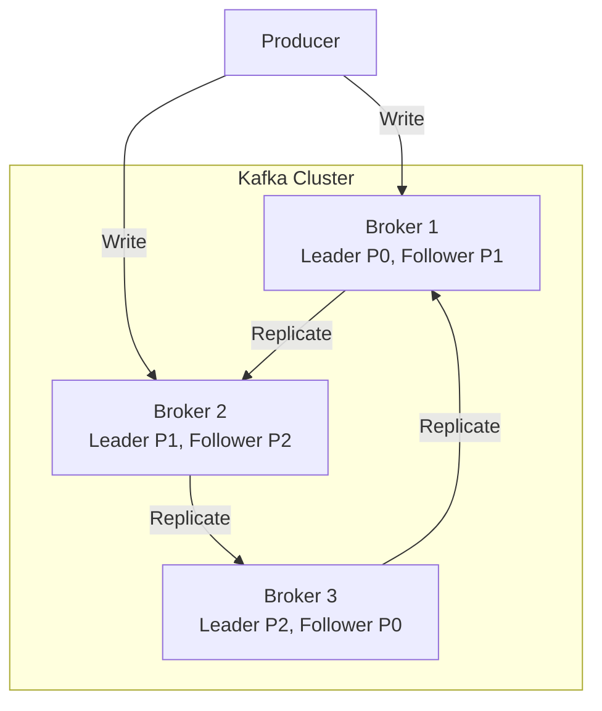
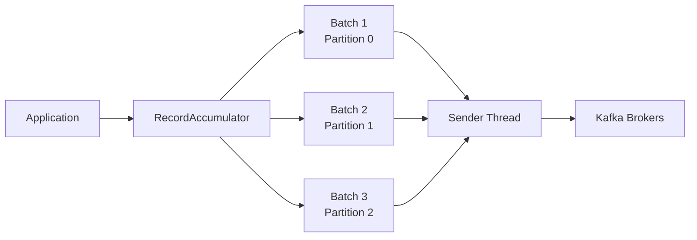
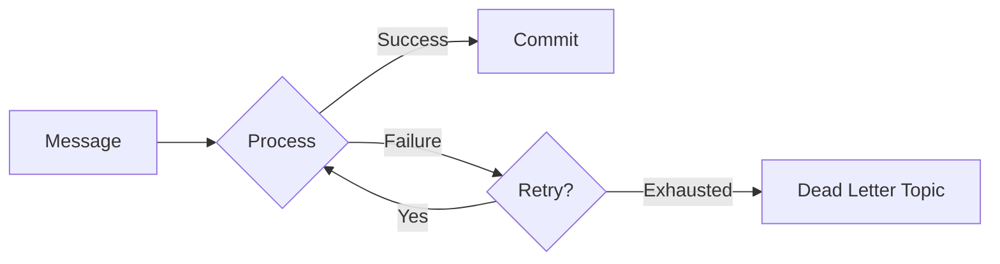
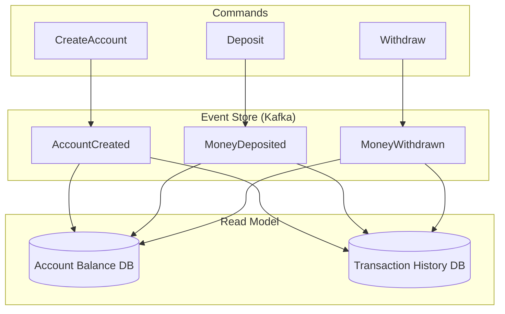
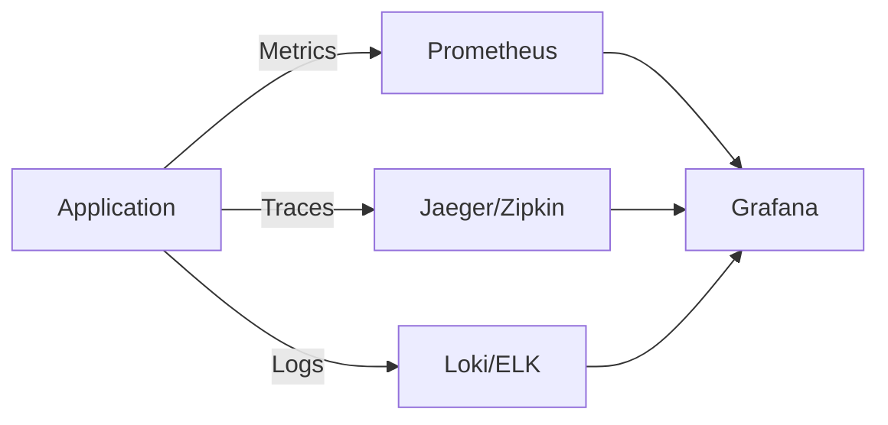

# Learn Apache Kafka with Spring Boot

A comprehensive, hands-on Apache Kafka learning book for experienced Java developers. Master Kafka internals and build production-grade systems using Spring Boot 3.x and Spring Kafka.

## About This Book

This repository is a practical, code-first guide to Apache Kafka. Each chapter combines theory with runnable code examples, real-world patterns, and hands-on exercises. By the end of this book, you'll understand Kafka at a deep level and be capable of building robust, scalable event-driven systems.

## Target Audience

- **Experienced Java developers** wanting to deeply understand Kafka
- **Backend engineers** building event-driven microservices
- **Architects** designing scalable distributed systems
- **Anyone** preparing for Kafka-related technical interviews

## Technology Stack

| Technology | Version | Purpose |
|------------|---------|---------|
| Java | 21+ | Modern Java with virtual threads |
| Spring Boot | 3.3.x | Application framework |
| Spring Kafka | 3.2.x | Kafka integration |
| Apache Kafka | 3.7+ | Message broker (KRaft mode) |
| Testcontainers | 1.20.x | Integration testing |
| Docker Compose | Latest | Local development |

> **Note**: This book uses **KRaft mode exclusively**. ZooKeeper is deprecated and not covered.

## Prerequisites

Before starting, ensure you have:

- [ ] Java 21 or later installed (`java -version`)
- [ ] Maven 3.9+ installed (`mvn -version`)
- [ ] Docker and Docker Compose installed (`docker --version`)
- [ ] An IDE (IntelliJ IDEA recommended)
- [ ] Basic understanding of Spring Boot
- [ ] Familiarity with messaging concepts

## Quick Start

```bash
# Clone the repository
git clone https://github.com/yourusername/learn-kafka-spring-boot.git
cd learn-kafka-spring-boot

# Start Kafka infrastructure (KRaft mode)
docker-compose -f infrastructure/docker-compose.yml up -d

# Build all modules
mvn clean install

# Run a specific chapter
cd chapter-01-kafka-architecture
mvn spring-boot:run
```

## Book Structure

```
learn-kafka-spring-boot/
├── infrastructure/              # Docker Compose files for Kafka
│   ├── docker-compose.yml       # Single broker setup
│   ├── docker-compose-cluster.yml # Multi-broker cluster
│   └── docker-compose-full.yml  # Full stack with monitoring
├── common/                      # Shared utilities and models
├── chapter-01-kafka-architecture/
├── chapter-02-kraft-mode/
├── ... (other chapters)
└── solutions/                   # Exercise solutions
```

---

## Table of Contents

### Part 1: Foundations

Master the core concepts and internals of Apache Kafka.

#### [Chapter 1: Kafka Architecture Internals](chapter-01-kafka-architecture/README.md)
Deep dive into how Kafka stores and manages data.

- Topics, partitions, and segments explained
- Log structure: index files, log files, timeindex files
- Replication protocol and ISR (In-Sync Replicas)
- Leader election mechanics
- **Hands-on**: Explore Kafka log directories, understand segment files



#### [Chapter 2: KRaft Mode Deep Dive](chapter-02-kraft-mode/README.md)
Understand the new consensus protocol that replaced ZooKeeper.

- Why ZooKeeper was replaced
- Controller quorum and metadata management
- KRaft vs ZooKeeper: architectural differences
- **Hands-on**: Set up and configure multi-broker KRaft cluster

#### [Chapter 3: Producer Internals](chapter-03-producer-internals/README.md)
Master the producer side of Kafka.

- Batching mechanics: `batch.size`, `linger.ms`, `buffer.memory`
- Partitioner strategies (sticky, round-robin, custom)
- Idempotent producers and exactly-once semantics
- Compression algorithms and trade-offs
- **Hands-on**: Build custom partitioner, measure throughput



#### [Chapter 4: Consumer Internals](chapter-04-consumer-internals/README.md)
Understand consumer mechanics and optimization.

- Consumer groups and partition assignment
- Offset management strategies
- Rebalancing protocols (eager vs cooperative)
- Poll loop optimization
- **Hands-on**: Implement custom `ConsumerRebalanceListener`

---

### Part 2: Spring Kafka Mastery

Learn to effectively use Spring Kafka in production applications.

#### [Chapter 5: Spring Kafka Foundations](chapter-05-spring-kafka-foundations/README.md)
Build a solid foundation with Spring Kafka.

- `KafkaTemplate` configuration and usage patterns
- `@KafkaListener` internals and container factories
- Serialization strategies (JSON, Avro, Protobuf)
- Configuration best practices
- **Hands-on**: Build type-safe producer/consumer with generics

```java
@KafkaListener(topics = "orders", groupId = "order-processor")
public void processOrder(Order order,
                        @Header(KafkaHeaders.RECEIVED_PARTITION) int partition,
                        Acknowledgment ack) {
    // Process order...
    ack.acknowledge();
}
```

#### [Chapter 6: Error Handling Patterns](chapter-06-error-handling/README.md)
Build resilient consumers that handle failures gracefully.

- `DefaultErrorHandler` configuration
- Dead Letter Topics (DLT) implementation
- Retry with exponential backoff
- Circuit breaker integration with Resilience4j
- **Hands-on**: Build resilient consumer with DLT and circuit breaker



#### [Chapter 7: Transactions and Exactly-Once](chapter-07-transactions/README.md)
Implement transactional messaging with exactly-once semantics.

- Transactional producers in Spring
- Consume-transform-produce pattern
- Transaction boundaries and isolation
- Coordinating with database transactions
- **Hands-on**: Build transactional order processing system

#### [Chapter 8: Testing Strategies](chapter-08-testing-strategies/README.md)
Comprehensive testing approaches for Kafka applications.

- `EmbeddedKafka` for unit tests
- Testcontainers for integration tests
- Testing async consumers with Awaitility
- Mocking Kafka for isolated tests
- **Hands-on**: Build comprehensive test suite

```java
@SpringBootTest
@Testcontainers
class OrderProcessorIntegrationTest {

    @Container
    static KafkaContainer kafka = new KafkaContainer(
        DockerImageName.parse("confluentinc/cp-kafka:7.6.0")
    );

    @Test
    void shouldProcessOrderAndPublishEvent() {
        // Test implementation...
    }
}
```

---

### Part 3: Advanced Patterns

Implement sophisticated patterns for complex business requirements.

#### [Chapter 9: Event-Driven Architecture](chapter-09-event-driven-architecture/README.md)
Design and implement event-driven systems.

- Event sourcing fundamentals with Kafka
- CQRS (Command Query Responsibility Segregation)
- Saga pattern for distributed transactions
- Event versioning and upcasting
- **Hands-on**: Build event-sourced banking system



#### [Chapter 10: Kafka Streams with Spring](chapter-10-kafka-streams/README.md)
Build stateful stream processing applications.

- KStream, KTable, and GlobalKTable
- Stateful processing with state stores
- Windowing operations (tumbling, hopping, session)
- Interactive queries
- **Hands-on**: Build real-time analytics dashboard backend

#### [Chapter 11: Schema Evolution](chapter-11-schema-evolution/README.md)
Manage schema changes without breaking consumers.

- Schema Registry integration
- Avro with Spring Kafka
- Protobuf with Spring Kafka
- Backward/forward/full compatibility
- **Hands-on**: Evolve schemas safely with compatibility checks

#### [Chapter 12: Performance Tuning](chapter-12-performance-tuning/README.md)
Optimize Kafka for maximum throughput and minimum latency.

- Producer tuning strategies
- Consumer tuning strategies
- Broker configuration essentials
- Benchmarking methodology
- **Hands-on**: Load testing and measuring improvements

| Configuration | Low Latency | High Throughput |
|--------------|-------------|-----------------|
| `linger.ms` | 0-5 | 50-100 |
| `batch.size` | 16KB | 64KB-128KB |
| `compression` | none/lz4 | lz4/zstd |
| `acks` | 1 | all |

---

### Part 4: Production Readiness

Prepare your Kafka applications for production deployment.

#### [Chapter 13: Observability](chapter-13-observability/README.md)
Monitor and troubleshoot Kafka applications.

- Micrometer metrics integration
- Distributed tracing with Micrometer Tracing
- Log correlation across services
- Alerting strategies
- **Hands-on**: Build Grafana dashboard for Kafka metrics



#### [Chapter 14: Security](chapter-14-security/README.md)
Secure your Kafka cluster and applications.

- SASL/SCRAM authentication
- TLS encryption (in-transit)
- ACLs and authorization
- Secrets management
- **Hands-on**: Configure secure multi-tenant Kafka setup

#### [Chapter 15: Operational Patterns](chapter-15-operational-patterns/README.md)
Run Kafka applications reliably in production.

- Partition rebalancing strategies
- Consumer lag monitoring and alerting
- Graceful shutdown patterns
- Zero-downtime deployments
- **Hands-on**: Implement health checks and graceful shutdown

---

## How to Use This Book

### Learning Path

1. **Beginners to Kafka**: Start from Chapter 1 and proceed sequentially
2. **Know basics, want Spring Kafka**: Start from Part 2 (Chapter 5)
3. **Building production systems**: Focus on Parts 3 and 4
4. **Interview preparation**: Review the "Interview Questions" section in each chapter

### Running the Examples

Each chapter contains runnable code. To run a chapter:

```bash
# Start the Kafka infrastructure
cd infrastructure
docker-compose up -d

# Navigate to the chapter
cd ../chapter-05-spring-kafka-foundations

# Run the application
mvn spring-boot:run

# Run tests
mvn test
```

### Exercises

Each chapter includes exercises. Try them yourself before checking the solutions:

```bash
# Solutions are in a separate branch
git checkout solutions
cd chapter-05-spring-kafka-foundations/exercises
```

---

## Key Concepts Quick Reference

### Producer Configuration Cheat Sheet

```yaml
spring:
  kafka:
    producer:
      # Reliability
      acks: all                    # Wait for all replicas
      retries: 3                   # Retry on failure

      # Performance
      batch-size: 16384            # 16KB batch
      linger-ms: 5                 # Wait up to 5ms to batch
      compression-type: lz4        # Compress batches

      # Exactly-once
      enable-idempotence: true     # Enable idempotent producer
      transactional-id: tx-prod-1  # Enable transactions
```

### Consumer Configuration Cheat Sheet

```yaml
spring:
  kafka:
    consumer:
      # Group management
      group-id: my-consumer-group

      # Offset management
      auto-offset-reset: earliest
      enable-auto-commit: false    # Manual commits recommended

      # Performance
      fetch-min-size: 1024         # 1KB minimum fetch
      fetch-max-wait: 500          # Wait up to 500ms
      max-poll-records: 500        # Records per poll

      # Reliability
      isolation-level: read_committed  # For transactions
```

### Common Kafka CLI Commands

```bash
# List topics
docker exec kafka kafka-topics --bootstrap-server localhost:9092 --list

# Create topic
docker exec kafka kafka-topics --bootstrap-server localhost:9092 \
  --create --topic my-topic --partitions 3 --replication-factor 1

# Describe topic
docker exec kafka kafka-topics --bootstrap-server localhost:9092 \
  --describe --topic my-topic

# Console producer
docker exec -it kafka kafka-console-producer \
  --bootstrap-server localhost:9092 --topic my-topic

# Console consumer
docker exec -it kafka kafka-console-consumer \
  --bootstrap-server localhost:9092 --topic my-topic --from-beginning

# Consumer groups
docker exec kafka kafka-consumer-groups --bootstrap-server localhost:9092 \
  --describe --group my-consumer-group
```

---

## Contributing

Found an issue or want to contribute? Please open an issue or pull request!

## License

This project is licensed under the MIT License - see the [LICENSE](LICENSE) file for details.

## Acknowledgments

- Apache Kafka documentation and community
- Spring Kafka team
- Confluent documentation and training materials
