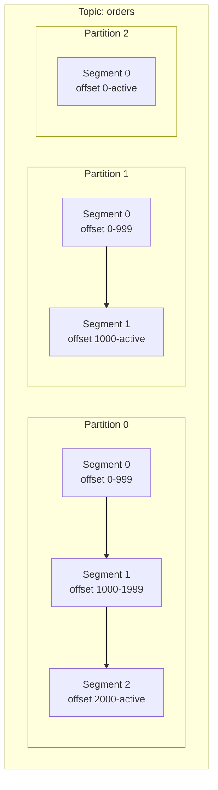
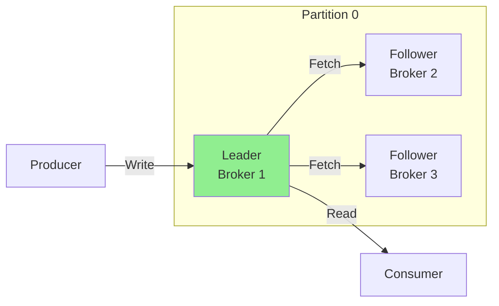
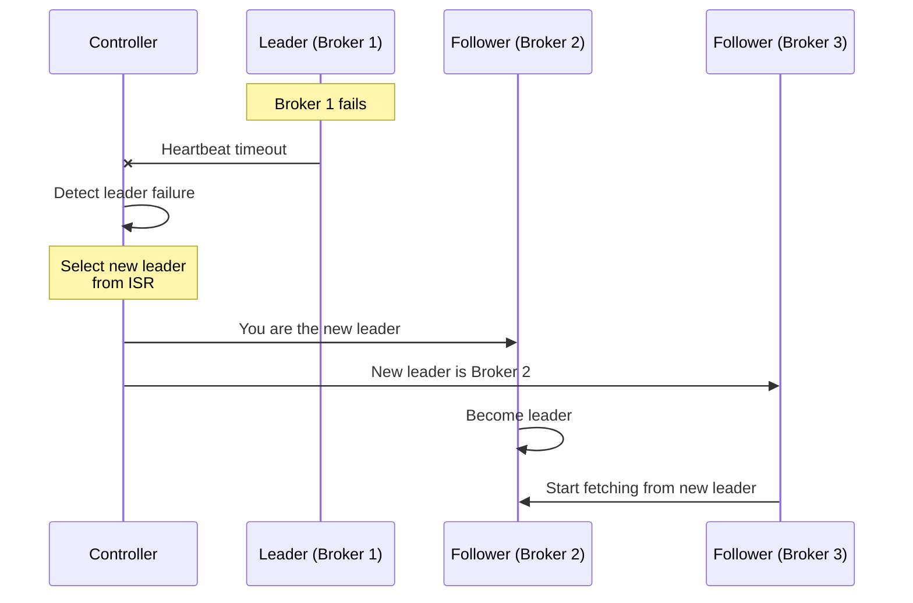

# Chapter 1: Kafka Architecture Internals

Understanding Kafka's internal architecture is essential for building performant, reliable systems. This chapter explores how Kafka stores and manages data at a deep level.

## Learning Objectives

By the end of this chapter, you will:
- Understand the relationship between topics, partitions, and segments
- Know how messages are physically stored on disk
- Understand the replication protocol and ISR concept
- Be able to explore and interpret Kafka log directories
- Understand leader election and failover mechanisms

## Prerequisites

- Docker and Docker Compose installed
- Kafka cluster running (see infrastructure setup)

```bash
cd ../infrastructure
docker-compose up -d
```

## Conceptual Overview

### Topics, Partitions, and Segments



**Topic**: A named stream of records, like a database table or file system folder.

**Partition**: Topics are split into partitions for parallelism. Each partition is:
- An ordered, immutable sequence of records
- Identified by a sequential offset starting from 0
- The unit of parallelism in Kafka

**Segment**: Partitions are split into segments for efficient management:
- Each segment is a pair of files (.log and .index)
- New segments are created based on size or time
- Old segments can be deleted or compacted based on retention policy

### Log Structure on Disk

When Kafka stores messages, it creates several files for each partition:

```
/var/lib/kafka/data/orders-0/
├── 00000000000000000000.log        # Message data
├── 00000000000000000000.index      # Offset index
├── 00000000000000000000.timeindex  # Timestamp index
├── 00000000000000001000.log        # Next segment (starts at offset 1000)
├── 00000000000000001000.index
├── 00000000000000001000.timeindex
├── leader-epoch-checkpoint
└── partition.metadata
```

**File naming**: The number is the base offset of that segment (e.g., `00000000000000001000.log` starts at offset 1000).

### Index Files Explained

Kafka uses sparse indexes for efficient message lookup:

```
.index file (offset → position mapping)
┌─────────────────────────────────────┐
│ Offset 0    → Position 0            │
│ Offset 100  → Position 15234        │
│ Offset 200  → Position 30512        │
│ Offset 300  → Position 45789        │
└─────────────────────────────────────┘

To find offset 150:
1. Binary search in index → offset 100 at position 15234
2. Linear scan from position 15234 until offset 150
```

The `.timeindex` file works similarly but maps timestamps to offsets, enabling time-based lookups.

### Message Format

Each record in the log contains:

```
┌──────────────────────────────────────────────────────────┐
│ Record Batch                                              │
├──────────────────────────────────────────────────────────┤
│ Base Offset (8 bytes)                                     │
│ Batch Length (4 bytes)                                    │
│ Partition Leader Epoch (4 bytes)                          │
│ Magic (1 byte) - Version number                           │
│ CRC (4 bytes) - Checksum                                  │
│ Attributes (2 bytes) - Compression, timestamp type        │
│ Last Offset Delta (4 bytes)                               │
│ First Timestamp (8 bytes)                                 │
│ Max Timestamp (8 bytes)                                   │
│ Producer ID (8 bytes)                                     │
│ Producer Epoch (2 bytes)                                  │
│ First Sequence (4 bytes)                                  │
│ Records Count (4 bytes)                                   │
├──────────────────────────────────────────────────────────┤
│ Records...                                                │
└──────────────────────────────────────────────────────────┘
```

### Replication



**Replication Factor**: How many copies of each partition exist (typically 3 in production).

**Leader**: One broker is the leader for each partition. All reads and writes go through the leader.

**Followers**: Other brokers passively replicate the leader's log.

### In-Sync Replicas (ISR)

ISR is the set of replicas that are "caught up" to the leader:

```
Leader Log:    [0, 1, 2, 3, 4, 5, 6, 7, 8, 9]
                                            ↑ Leader End Offset (LEO)

Follower 1:    [0, 1, 2, 3, 4, 5, 6, 7, 8, 9]  ← In ISR
Follower 2:    [0, 1, 2, 3, 4, 5, 6, 7]        ← NOT in ISR (lagging)

High Watermark: 9 (if Follower 2 is out of ISR)
               or 7 (if Follower 2 is in ISR)
```

**High Watermark (HW)**: The offset up to which all ISR replicas have replicated. Consumers can only read up to the HW.

**Why ISR matters**:
- `acks=all` waits for all ISR replicas to acknowledge
- Leader election only considers ISR members
- Data durability depends on ISR configuration

### Leader Election

When a leader fails, Kafka elects a new leader from the ISR:



## Hands-On Lab: Exploring Kafka Logs

### Step 1: Start the Infrastructure

```bash
cd ../infrastructure
docker-compose up -d
```

### Step 2: Run the Application

```bash
cd ../chapter-01-kafka-architecture
mvn spring-boot:run
```

### Step 3: Use the REST API to Explore

```bash
# Create a topic and produce messages
curl -X POST "http://localhost:8080/api/architecture/setup"

# View cluster information
curl "http://localhost:8080/api/architecture/cluster-info"

# View topic details
curl "http://localhost:8080/api/architecture/topics/architecture.demo"

# Produce test messages
curl -X POST "http://localhost:8080/api/architecture/produce?count=1000"
```

### Step 4: Explore the Log Directory

```bash
# Access the Kafka container
docker exec -it kafka bash

# Navigate to the data directory
cd /var/lib/kafka/data

# List all topic-partitions
ls -la

# Explore a specific partition
cd architecture.demo-0
ls -la

# View the log file (binary, but you can see some content)
xxd 00000000000000000000.log | head -50

# Use Kafka's dump tool to read the log
kafka-dump-log \
  --files /var/lib/kafka/data/architecture.demo-0/00000000000000000000.log \
  --print-data-log | head -50
```

### Step 5: Understand Segment Rotation

```bash
# Produce more messages to trigger segment rotation
curl -X POST "http://localhost:8080/api/architecture/produce?count=10000"

# Check for new segments
docker exec kafka ls -la /var/lib/kafka/data/architecture.demo-0/

# You should see multiple .log files if segment size is exceeded
```

## Code Walkthrough

### Kafka Admin Client Usage

```java
@Service
public class KafkaClusterExplorer {

    private final AdminClient adminClient;

    // Constructor injection - Spring Boot best practice
    public KafkaClusterExplorer(AdminClient adminClient) {
        this.adminClient = adminClient;
    }

    /**
     * Retrieves comprehensive cluster information.
     *
     * WHY: Understanding the cluster state helps diagnose issues
     * and plan capacity.
     */
    public ClusterInfo getClusterInfo() {
        // DescribeClusterResult is async - we block for simplicity
        // In production, consider reactive patterns
        var cluster = adminClient.describeCluster();

        return new ClusterInfo(
            cluster.clusterId().get(),
            cluster.controller().get(),
            cluster.nodes().get()
        );
    }
}
```

### Topic Configuration Analysis

```java
/**
 * Analyzes topic configuration to understand how Kafka manages data.
 *
 * Key configurations to understand:
 * - segment.bytes: When to create new segments
 * - retention.ms: How long to keep data
 * - min.insync.replicas: Durability guarantees
 */
public TopicAnalysis analyzeTopicConfig(String topicName) {
    var configs = adminClient.describeConfigs(
        List.of(new ConfigResource(ConfigResource.Type.TOPIC, topicName))
    ).all().get();

    // Extract key configurations
    var topicConfig = configs.get(
        new ConfigResource(ConfigResource.Type.TOPIC, topicName)
    );

    return TopicAnalysis.builder()
        .segmentBytes(getLongConfig(topicConfig, "segment.bytes"))
        .retentionMs(getLongConfig(topicConfig, "retention.ms"))
        .minInsyncReplicas(getIntConfig(topicConfig, "min.insync.replicas"))
        .build();
}
```

## Key Concepts Summary

| Concept | Definition | Impact |
|---------|------------|--------|
| **Partition** | Unit of parallelism | More partitions = more parallelism |
| **Segment** | Physical file on disk | Affects cleanup and compaction |
| **Offset** | Sequential message ID | Used for consumer positioning |
| **ISR** | In-Sync Replicas | Determines durability and availability |
| **HW** | High Watermark | Consumer visibility boundary |
| **LEO** | Log End Offset | Leader's latest offset |

## Common Pitfalls

### 1. Too Many Partitions
**Problem**: Each partition has overhead (file handles, memory).
**Symptom**: Slow recovery, high memory usage.
**Solution**: Start with fewer partitions; scale up as needed.

### 2. Segment Size Too Small
**Problem**: Frequent segment rotation causes I/O overhead.
**Solution**: Use larger segment sizes (default 1GB is usually fine).

### 3. ISR Size Configuration
**Problem**: `min.insync.replicas` > actual ISR size blocks writes.
**Solution**: Ensure sufficient healthy replicas before setting high min.insync.replicas.

## Exercises

### Exercise 1: Segment Analysis
1. Create a topic with `segment.bytes=10000` (very small)
2. Produce 100 messages
3. Count the number of segment files created
4. Compare with default segment size

### Exercise 2: ISR Observation
1. Using docker-compose-cluster.yml, start a 3-broker cluster
2. Create a topic with replication factor 3
3. Stop one broker
4. Observe ISR changes using `kafka-topics --describe`
5. Restart the broker and watch it rejoin ISR

### Exercise 3: Index Deep Dive
1. Use `kafka-dump-log` with `--index-sanity-check` option
2. Verify index integrity
3. Understand sparse indexing by examining index entries

## Interview Questions

### Beginner
1. **Q**: What is the relationship between topics and partitions?
   **A**: A topic is divided into partitions. Partitions enable parallelism - multiple consumers can read from different partitions simultaneously. Each partition is an ordered, immutable sequence of records.

2. **Q**: Why does Kafka use segments?
   **A**: Segments enable efficient log cleanup (retention), compaction, and faster recovery. Only the active segment is written to; older segments can be deleted or compacted without affecting writes.

### Intermediate
3. **Q**: Explain the difference between High Watermark and Log End Offset.
   **A**: LEO is the offset of the next message to be written by the leader. HW is the offset up to which all ISR replicas have replicated. Consumers can only read up to HW. The gap between LEO and HW represents data not yet safely replicated.

4. **Q**: What happens when ISR shrinks to just the leader?
   **A**: With `min.insync.replicas=1`, writes continue but with reduced durability. With `min.insync.replicas=2`, writes fail with NotEnoughReplicasException. This is a trade-off between availability and durability.

### Advanced
5. **Q**: How does Kafka achieve efficient reads when consumers request old offsets?
   **A**: Kafka uses sparse indexes (.index files) that map offsets to physical positions. Binary search finds the nearest index entry, then a linear scan locates the exact offset. This provides O(log n) + O(k) lookup where k is the index interval.

6. **Q**: Describe the leader election process in KRaft mode.
   **A**: In KRaft mode, the controller quorum (using Raft consensus) maintains metadata including partition leadership. When a broker fails, the active controller detects this through missing heartbeats, selects a new leader from the ISR, and propagates the change to all brokers. There's no ZooKeeper involved - it's purely Raft-based.

## References

- [Kafka Documentation: Log Compaction](https://kafka.apache.org/documentation/#compaction)
- [Kafka Documentation: Replication](https://kafka.apache.org/documentation/#replication)
- [KIP-500: Replace ZooKeeper with a Self-Managed Metadata Quorum](https://cwiki.apache.org/confluence/display/KAFKA/KIP-500)
- [Kafka Internals: How Kafka Stores Data](https://developer.confluent.io/learn-kafka/architecture/log/)

## Next Chapter

Continue to [Chapter 2: KRaft Mode Deep Dive](../chapter-02-kraft-mode/README.md) to understand how Kafka manages itself without ZooKeeper.
