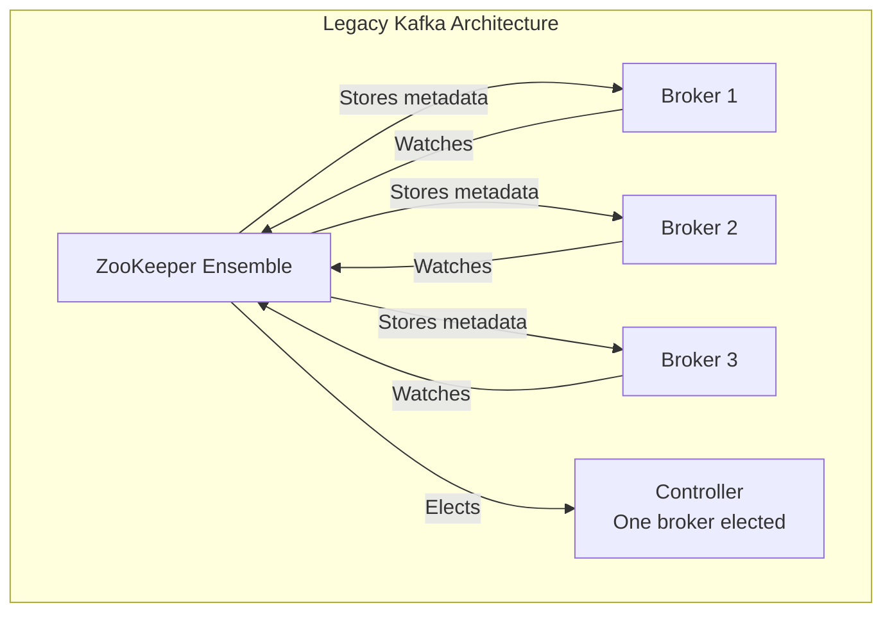
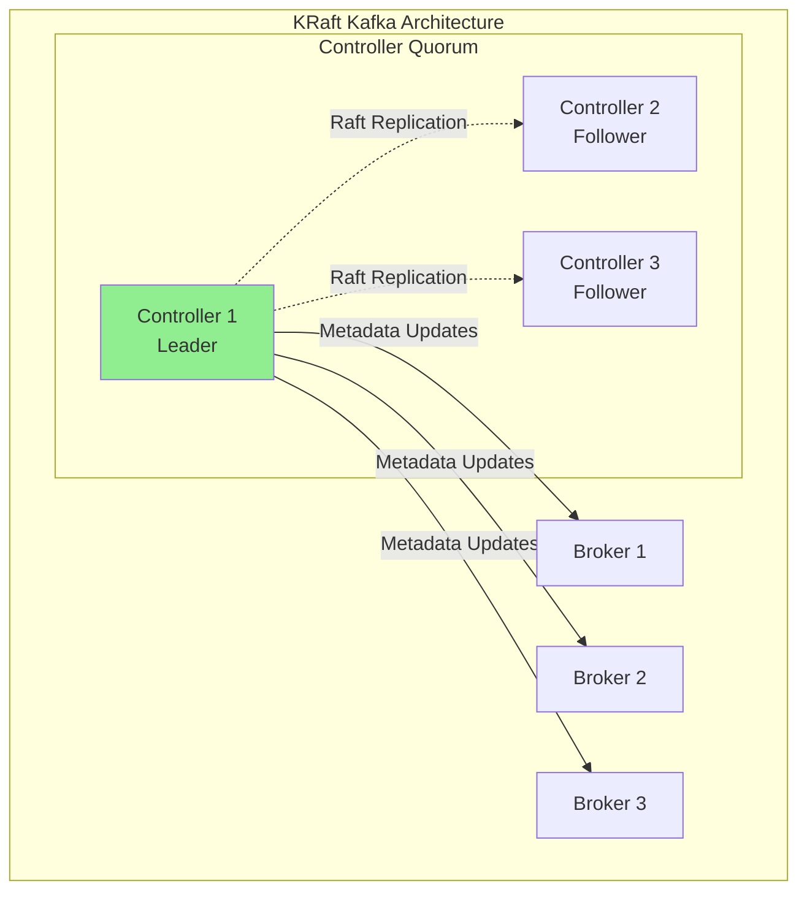
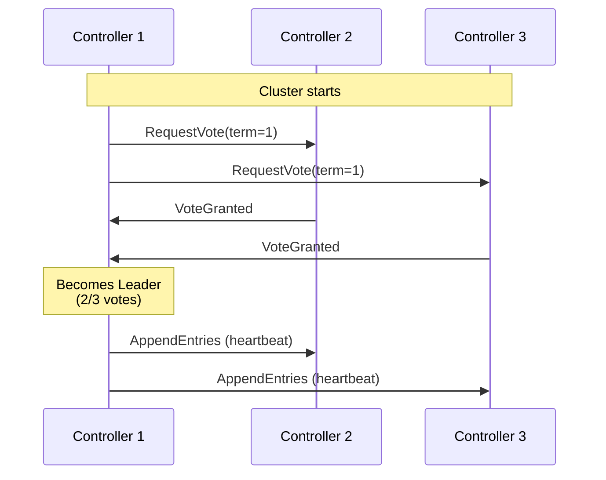
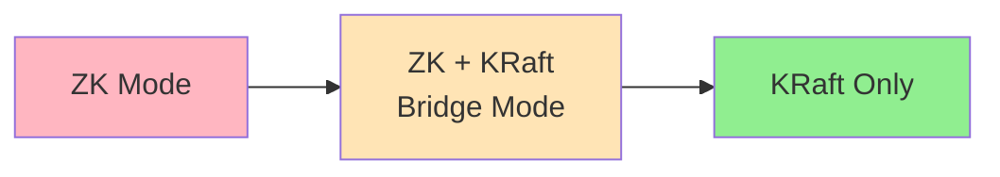

# Chapter 2: KRaft Mode Deep Dive

KRaft (Kafka Raft) mode is Kafka's new architecture that eliminates the dependency on Apache ZooKeeper. This chapter explains why this change was made and how KRaft works.

## Learning Objectives

By the end of this chapter, you will:
- Understand why ZooKeeper was replaced
- Know how the controller quorum works
- Understand metadata management in KRaft
- Be able to configure and troubleshoot KRaft clusters

## Prerequisites

```bash
cd ../infrastructure
docker-compose -f docker-compose-cluster.yml up -d
```

## Why ZooKeeper Was Replaced

### ZooKeeper's Role in Legacy Kafka



ZooKeeper was used for:
- **Controller election**: Choosing which broker handles metadata operations
- **Metadata storage**: Topic configurations, partition assignments, ACLs
- **Broker liveness**: Tracking which brokers are alive via ephemeral nodes
- **Consumer offsets** (legacy): Before Kafka stored them internally

### Problems with ZooKeeper

1. **Operational Complexity**
   - Two systems to deploy, monitor, and upgrade
   - Different configuration languages and tools
   - Separate security configuration

2. **Scalability Limitations**
   - ZooKeeper became a bottleneck for large clusters
   - Metadata operations slowed with thousands of partitions
   - Controller failover could take minutes

3. **Split-Brain Risk**
   - Inconsistencies between ZooKeeper and broker state
   - Complex recovery procedures

4. **Development Burden**
   - Kafka team maintaining two distributed systems
   - Different testing requirements

## KRaft Architecture

### Single System, Single Protocol



### Key Components

**Controller Quorum**: A set of nodes running the Raft consensus protocol for metadata.

**Metadata Log**: An internal topic (`__cluster_metadata`) storing all cluster state.

**Broker**: Regular brokers that receive metadata updates from controllers.

### Node Roles

In KRaft, a node can have one or both roles:

| Role | Description | When to Use |
|------|-------------|-------------|
| `controller` | Participates in metadata quorum | Dedicated controllers for large clusters |
| `broker` | Stores data, serves clients | Standard data nodes |
| `broker,controller` | Both roles | Small clusters, development |

```yaml
# Combined role (development/small clusters)
KAFKA_PROCESS_ROLES: 'broker,controller'

# Dedicated controller (production)
KAFKA_PROCESS_ROLES: 'controller'

# Dedicated broker (production)
KAFKA_PROCESS_ROLES: 'broker'
```

## The Raft Protocol in Kafka

### Leader Election



### Metadata Replication

All metadata changes go through the Raft log:

```
Metadata Log (offset-based like regular Kafka)
┌─────────────────────────────────────────────────┐
│ Offset 0: TopicRecord (orders, uuid=...)        │
│ Offset 1: PartitionRecord (orders-0, leader=1)  │
│ Offset 2: PartitionRecord (orders-1, leader=2)  │
│ Offset 3: BrokerRegistration (broker-1)         │
│ Offset 4: ConfigRecord (retention.ms=...)       │
│ ...                                             │
└─────────────────────────────────────────────────┘
```

## Configuration Deep Dive

### Essential KRaft Settings

```properties
# Node identification
node.id=1                          # Unique across the cluster
process.roles=broker,controller    # Node roles

# Controller quorum configuration
controller.quorum.voters=1@controller1:9093,2@controller2:9093,3@controller3:9093

# Cluster ID (must be same for all nodes)
cluster.id=MkU3OEVBNTcwNTJENDM2Qk

# Listener configuration
controller.listener.names=CONTROLLER
listeners=PLAINTEXT://:9092,CONTROLLER://:9093
```

### Docker Compose Translation

```yaml
environment:
  KAFKA_NODE_ID: 1
  KAFKA_PROCESS_ROLES: 'broker,controller'
  KAFKA_CONTROLLER_QUORUM_VOTERS: '1@kafka-1:9093,2@kafka-2:9093,3@kafka-3:9093'
  CLUSTER_ID: 'MkU3OEVBNTcwNTJENDM2Qk'
  KAFKA_CONTROLLER_LISTENER_NAMES: 'CONTROLLER'
  KAFKA_LISTENERS: 'PLAINTEXT://0.0.0.0:9092,CONTROLLER://0.0.0.0:9093'
```

### Generating Cluster ID

```bash
# Generate a new cluster ID
kafka-storage random-uuid
# Output: MkU3OEVBNTcwNTJENDM2Qk

# Format storage with cluster ID
kafka-storage format -t MkU3OEVBNTcwNTJENDM2Qk -c /path/to/server.properties
```

## Hands-On Lab

### Step 1: Start Multi-Broker KRaft Cluster

```bash
cd ../infrastructure
docker-compose -f docker-compose-cluster.yml up -d

# Verify all brokers are running
docker-compose -f docker-compose-cluster.yml ps
```

### Step 2: Observe Controller Quorum

```bash
# Check which controller is the leader
docker exec kafka-1 kafka-metadata --snapshot /var/lib/kafka/data/__cluster_metadata-0/00000000000000000000.log --command "describe"

# Alternative: Use kafka-metadata tool
docker exec kafka-1 kafka-metadata quorum-info --bootstrap-server localhost:9092
```

### Step 3: Run the Application

```bash
cd ../chapter-02-kraft-mode
mvn spring-boot:run
```

### Step 4: Explore Controller Metadata

```bash
# Get quorum information
curl http://localhost:8080/api/kraft/quorum-info

# Get metadata log info
curl http://localhost:8080/api/kraft/metadata-log

# Simulate controller failover
docker stop kafka-1
sleep 5
curl http://localhost:8080/api/kraft/quorum-info
docker start kafka-1
```

### Step 5: Understand Controller Failover

```bash
# Watch logs during failover
docker-compose -f docker-compose-cluster.yml logs -f kafka-2 | grep -i "controller\|leader\|election"

# Stop the leader
docker stop kafka-1

# Observe new leader election in logs
# Restart and watch rejoin
docker start kafka-1
```

## Migration from ZooKeeper

### Migration Path



1. **Preparation**: Ensure Kafka version supports KRaft (3.3+)
2. **Bridge Mode**: Run both ZK and KRaft controllers temporarily
3. **Migration**: Transfer metadata to KRaft controllers
4. **Cutover**: Switch to KRaft-only mode
5. **Cleanup**: Remove ZooKeeper

### Migration Commands

```bash
# Generate migration plan
kafka-metadata --zookeeper-config zk.properties \
  --kraft-config kraft.properties \
  --command migrate-metadata

# Verify migration
kafka-metadata --snapshot /path/to/snapshot --command describe
```

## Comparing ZooKeeper and KRaft

| Aspect | ZooKeeper Mode | KRaft Mode |
|--------|---------------|------------|
| **Metadata Storage** | ZooKeeper znodes | Internal Kafka log |
| **Controller Election** | ZooKeeper ephemeral nodes | Raft protocol |
| **Failover Time** | Minutes (large clusters) | Seconds |
| **Scalability** | ~200K partitions practical limit | 1M+ partitions |
| **Operational Complexity** | Two systems | Single system |
| **Configuration** | Two config languages | Unified configuration |

## Code Walkthrough

### Querying Controller Quorum

```java
@Service
public class KRaftMetadataService {

    private final AdminClient adminClient;

    public KRaftMetadataService(AdminClient adminClient) {
        this.adminClient = adminClient;
    }

    /**
     * Get information about the controller quorum.
     *
     * This uses the DescribeQuorum API introduced with KRaft.
     */
    public QuorumInfo getQuorumInfo() throws Exception {
        DescribeQuorumResult result = adminClient.describeQuorum();
        QuorumInfo quorumInfo = result.quorumInfo().get();

        return quorumInfo;
    }

    /**
     * Get the current controller ID.
     */
    public int getControllerId() throws Exception {
        return adminClient.describeCluster()
            .controller()
            .get()
            .id();
    }
}
```

## Troubleshooting KRaft

### Common Issues

**1. Cluster Won't Start**
```bash
# Check if cluster ID matches across all nodes
docker exec kafka-1 cat /var/lib/kafka/data/meta.properties
docker exec kafka-2 cat /var/lib/kafka/data/meta.properties

# Verify quorum voters configuration matches
docker exec kafka-1 env | grep QUORUM
```

**2. Controller Election Failing**
```bash
# Check controller logs
docker logs kafka-1 2>&1 | grep -i "vote\|election\|leader"

# Verify network connectivity between controllers
docker exec kafka-1 nc -zv kafka-2 9093
docker exec kafka-1 nc -zv kafka-3 9093
```

**3. Brokers Can't Connect to Controller**
```bash
# Verify listener configuration
docker exec kafka-1 kafka-broker-api-versions --bootstrap-server localhost:9092

# Check controller listener is accessible
docker exec kafka-1 nc -zv localhost 9093
```

## Interview Questions

### Beginner
1. **Q**: What is KRaft mode and why was it introduced?
   **A**: KRaft (Kafka Raft) mode allows Kafka to manage its own metadata without ZooKeeper dependency. It was introduced to simplify operations, improve scalability (supporting 1M+ partitions), reduce failover time, and eliminate the need to maintain two distributed systems.

2. **Q**: What are the different process roles in KRaft?
   **A**: `broker` (handles client requests and data storage), `controller` (participates in metadata quorum), or both. Small clusters typically run combined roles; large production clusters use dedicated controllers.

### Intermediate
3. **Q**: How does controller election work in KRaft?
   **A**: KRaft uses the Raft consensus protocol. Controllers exchange RequestVote messages at the start of each term. A candidate needs a majority of votes to become leader. Leaders send periodic heartbeats (AppendEntries) to maintain leadership. If followers don't receive heartbeats, they start a new election.

4. **Q**: What is the metadata log and how does it differ from regular Kafka topics?
   **A**: The metadata log (`__cluster_metadata`) stores all cluster state: topics, partitions, configs, ACLs, etc. Unlike regular topics, it uses Raft replication (not ISR-based), has stronger consistency guarantees, and is managed exclusively by controllers.

### Advanced
5. **Q**: How does KRaft handle split-brain scenarios?
   **A**: Raft's quorum requirement (majority of votes needed) prevents split-brain. If the network partitions and neither side has a majority of controllers, no leader can be elected, preventing conflicting decisions. When the partition heals, the side with newer term wins.

6. **Q**: Describe the metadata snapshot and truncation process.
   **A**: The controller periodically snapshots the metadata log to enable faster startup and bounded storage. Snapshots contain the full metadata state at a point in time. After snapshotting, older log segments can be truncated. New controllers bootstrap from the latest snapshot plus subsequent log entries.

## References

- [KIP-500: Replace ZooKeeper with a Self-Managed Metadata Quorum](https://cwiki.apache.org/confluence/display/KAFKA/KIP-500)
- [KIP-595: A Raft Protocol for the Metadata Quorum](https://cwiki.apache.org/confluence/display/KAFKA/KIP-595)
- [Kafka Documentation: KRaft](https://kafka.apache.org/documentation/#kraft)
- [Confluent: Kafka Without ZooKeeper](https://www.confluent.io/blog/removing-zookeeper-dependency-in-kafka/)

## Next Chapter

Continue to [Chapter 3: Producer Internals](../chapter-03-producer-internals/README.md) to understand how producers send messages efficiently.
