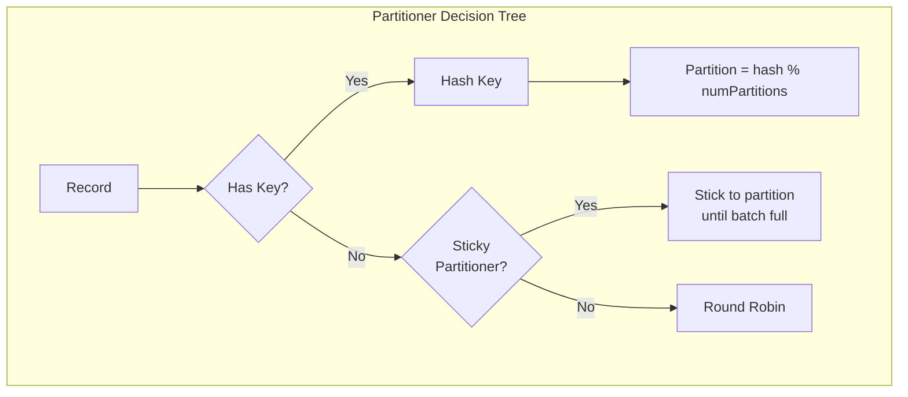
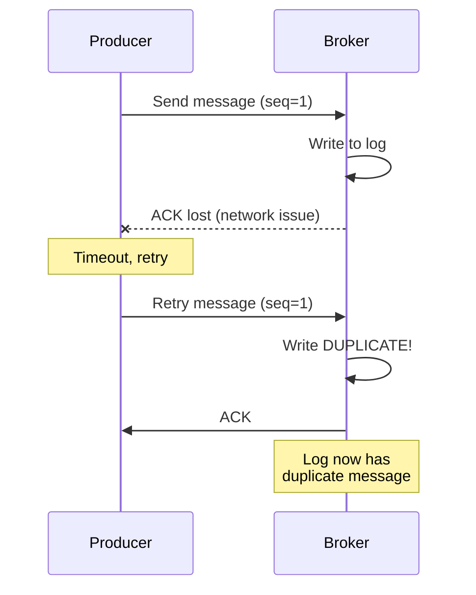
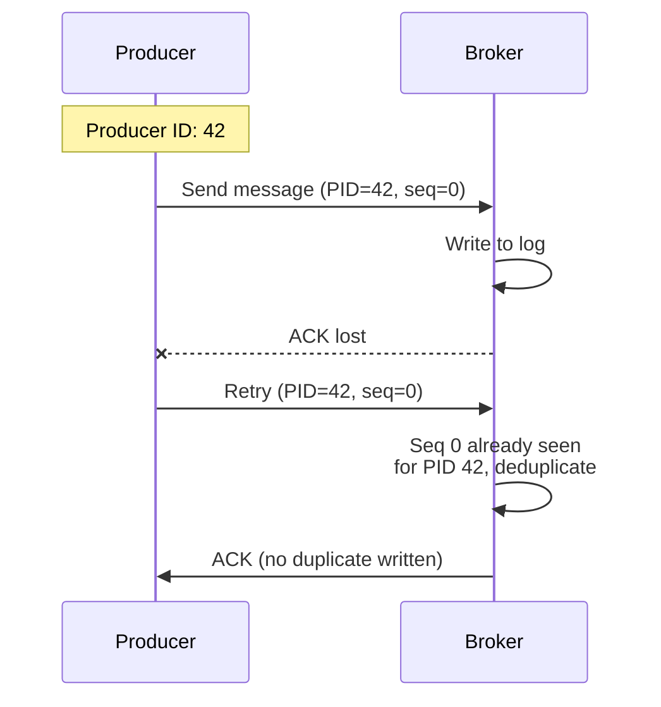

# Chapter 3: Producer Internals

Understanding how Kafka producers work internally is essential for optimizing throughput, ensuring reliability, and troubleshooting issues. This chapter explores the producer architecture in depth.

## Learning Objectives

By the end of this chapter, you will:
- Understand the producer's internal architecture (batching, buffering, sending)
- Know how to configure producers for different use cases (throughput vs latency)
- Implement custom partitioners
- Configure idempotent producers for exactly-once semantics
- Measure and optimize producer performance

## Producer Architecture Overview

```mermaid
graph TB
    subgraph "Producer Process"
        A[Application Thread]
        M[Metadata Cache]
        I[Interceptors]
        S[Serializers]
        P[Partitioner]

        subgraph "RecordAccumulator"
            B1[Batch - Partition 0]
            B2[Batch - Partition 1]
            B3[Batch - Partition 2]
        end

        T[Sender Thread]
        N[NetworkClient]
    end

    subgraph "Kafka Cluster"
        K1[Broker 1]
        K2[Broker 2]
        K3[Broker 3]
    end

    A -->|1. send()| I
    I -->|2. serialize| S
    S -->|3. partition| P
    P -->|4. append| B1
    P -->|4. append| B2
    P -->|4. append| B3

    T -->|5. drain batches| B1
    T -->|5. drain batches| B2
    T -->|5. drain batches| B3

    T -->|6. send requests| N
    N -->|7. produce| K1
    N -->|7. produce| K2
    N -->|7. produce| K3

    M -.->|partition info| P
```

## Key Configuration Parameters

### Batching Configuration

| Parameter | Default | Description | Impact |
|-----------|---------|-------------|--------|
| `batch.size` | 16384 (16KB) | Maximum batch size in bytes | Larger = better throughput |
| `linger.ms` | 0 | Time to wait for more records | Higher = better batching |
| `buffer.memory` | 33554432 (32MB) | Total memory for buffering | Limits outstanding sends |
| `max.block.ms` | 60000 | Max time to block on send() | Affects backpressure handling |

```java
// High Throughput Configuration
props.put(ProducerConfig.BATCH_SIZE_CONFIG, 65536);      // 64KB
props.put(ProducerConfig.LINGER_MS_CONFIG, 50);          // Wait up to 50ms
props.put(ProducerConfig.COMPRESSION_TYPE_CONFIG, "lz4"); // Compress batches

// Low Latency Configuration
props.put(ProducerConfig.BATCH_SIZE_CONFIG, 1);          // Minimal batching
props.put(ProducerConfig.LINGER_MS_CONFIG, 0);           // Send immediately
props.put(ProducerConfig.ACKS_CONFIG, "1");              // Only leader ack
```

### Reliability Configuration

| Parameter | Default | Description |
|-----------|---------|-------------|
| `acks` | all | Acknowledgment level (0, 1, all) |
| `retries` | 2147483647 | Number of retries on failure |
| `enable.idempotence` | true | Enable exactly-once per partition |
| `max.in.flight.requests.per.connection` | 5 | Outstanding requests per broker |

## Partitioning Strategies

### Built-in Partitioners



**1. Key-Based Partitioning (default when key present)**
```java
// Same key always goes to same partition
producer.send(new ProducerRecord<>("orders", customerId, orderJson));
// Ensures order for customer's orders
```

**2. Sticky Partitioner (default when no key, Kafka 2.4+)**
```java
// Records batched to same partition until batch is full
producer.send(new ProducerRecord<>("events", null, eventJson));
// Better batching than round-robin
```

**3. Round-Robin (legacy, no key)**
- Distributes evenly but poor batching
- Each record may go to different partition

### Custom Partitioner Implementation

```java
/**
 * Custom partitioner that routes high-priority orders to partition 0.
 *
 * Use case: Ensure critical orders are processed first by
 * having dedicated consumers for partition 0.
 */
public class PriorityPartitioner implements Partitioner {

    @Override
    public int partition(String topic, Object key, byte[] keyBytes,
                        Object value, byte[] valueBytes, Cluster cluster) {

        List<PartitionInfo> partitions = cluster.partitionsForTopic(topic);
        int numPartitions = partitions.size();

        // Route high-priority to partition 0
        if (value instanceof Order order && order.priority() == Priority.HIGH) {
            return 0;
        }

        // Otherwise use default key-based or round-robin
        if (keyBytes == null) {
            return ThreadLocalRandom.current().nextInt(numPartitions);
        }

        return Utils.toPositive(Utils.murmur2(keyBytes)) % numPartitions;
    }

    @Override
    public void configure(Map<String, ?> configs) {}

    @Override
    public void close() {}
}
```

## Idempotent Producer

### The Duplicate Problem

Without idempotence, retries can cause duplicates:



### Idempotent Producer Solution



### Configuration

```java
// Enable idempotence (default in Kafka 3.0+)
props.put(ProducerConfig.ENABLE_IDEMPOTENCE_CONFIG, true);

// Required settings (automatically set when idempotence enabled)
// acks=all
// retries > 0
// max.in.flight.requests.per.connection <= 5
```

## Compression

### Compression Types

| Type | CPU | Compression Ratio | Use Case |
|------|-----|-------------------|----------|
| none | - | 1:1 | Low CPU, local network |
| gzip | High | Best (~75-80%) | Archival, slow networks |
| snappy | Low | Good (~50-60%) | Balanced performance |
| lz4 | Very Low | Good (~55-65%) | High throughput |
| zstd | Medium | Excellent (~70-80%) | Best overall |

```java
// Recommended for most use cases
props.put(ProducerConfig.COMPRESSION_TYPE_CONFIG, "lz4");

// For best compression (slightly more CPU)
props.put(ProducerConfig.COMPRESSION_TYPE_CONFIG, "zstd");
```

## Hands-On Lab

### Step 1: Start Infrastructure

```bash
cd ../infrastructure
docker-compose up -d
```

### Step 2: Run the Application

```bash
cd ../chapter-03-producer-internals
mvn spring-boot:run
```

### Step 3: Explore Producer Configurations

```bash
# Test high-throughput configuration
curl -X POST "http://localhost:8080/api/producer/high-throughput?count=10000"

# Test low-latency configuration
curl -X POST "http://localhost:8080/api/producer/low-latency?count=100"

# Compare metrics
curl http://localhost:8080/actuator/prometheus | grep kafka_producer
```

### Step 4: Test Custom Partitioner

```bash
# Send orders with different priorities
curl -X POST "http://localhost:8080/api/producer/priority-order" \
  -H "Content-Type: application/json" \
  -d '{"orderId": "1", "priority": "HIGH"}'

curl -X POST "http://localhost:8080/api/producer/priority-order" \
  -H "Content-Type: application/json" \
  -d '{"orderId": "2", "priority": "LOW"}'

# Check partition distribution
curl http://localhost:8080/api/producer/partition-stats
```

### Step 5: Measure Throughput

```bash
# Run benchmark
curl -X POST "http://localhost:8080/api/producer/benchmark?messages=100000&batchSize=65536&lingerMs=50"

# Results show messages/second and latency percentiles
```

## Code Walkthrough

### Producer Configuration

```java
@Configuration
public class ProducerConfig {

    @Bean
    public ProducerFactory<String, String> highThroughputProducerFactory() {
        Map<String, Object> props = new HashMap<>();
        props.put(ProducerConfig.BOOTSTRAP_SERVERS_CONFIG, "localhost:9092");

        // Serialization
        props.put(ProducerConfig.KEY_SERIALIZER_CLASS_CONFIG, StringSerializer.class);
        props.put(ProducerConfig.VALUE_SERIALIZER_CLASS_CONFIG, StringSerializer.class);

        // High throughput settings
        props.put(ProducerConfig.BATCH_SIZE_CONFIG, 65536);      // 64KB batches
        props.put(ProducerConfig.LINGER_MS_CONFIG, 50);          // Wait 50ms for batching
        props.put(ProducerConfig.COMPRESSION_TYPE_CONFIG, "lz4"); // Compress
        props.put(ProducerConfig.BUFFER_MEMORY_CONFIG, 67108864); // 64MB buffer

        // Reliability
        props.put(ProducerConfig.ACKS_CONFIG, "all");
        props.put(ProducerConfig.ENABLE_IDEMPOTENCE_CONFIG, true);

        return new DefaultKafkaProducerFactory<>(props);
    }
}
```

### Async Send with Callbacks

```java
@Service
public class ProducerService {

    private final KafkaTemplate<String, String> kafkaTemplate;

    public CompletableFuture<SendResult<String, String>> sendAsync(
            String topic, String key, String value) {

        return kafkaTemplate.send(topic, key, value)
            .whenComplete((result, ex) -> {
                if (ex == null) {
                    log.info("Sent to partition {} offset {}",
                        result.getRecordMetadata().partition(),
                        result.getRecordMetadata().offset());
                } else {
                    log.error("Send failed: {}", ex.getMessage());
                }
            });
    }
}
```

## Performance Tuning Guidelines

### For Maximum Throughput

```yaml
spring:
  kafka:
    producer:
      batch-size: 65536        # 64KB
      properties:
        linger.ms: 100         # Wait longer for bigger batches
        compression.type: lz4
        buffer.memory: 67108864 # 64MB
```

### For Minimum Latency

```yaml
spring:
  kafka:
    producer:
      batch-size: 1
      properties:
        linger.ms: 0
        acks: 1                # Don't wait for all replicas
```

### For Maximum Reliability

```yaml
spring:
  kafka:
    producer:
      acks: all
      properties:
        enable.idempotence: true
        max.in.flight.requests.per.connection: 1
        retries: 2147483647
```

## Common Pitfalls

### 1. Blocking the Sender Thread
**Problem**: Slow serialization blocks the sender.
**Solution**: Keep serialization fast; consider async serialization.

### 2. Buffer Memory Exhaustion
**Problem**: `send()` blocks when buffer is full.
**Solution**: Increase `buffer.memory` or implement backpressure.

### 3. Silent Failures
**Problem**: Ignoring send results loses messages.
**Solution**: Always handle futures or use callbacks.

```java
// BAD - fire and forget, no error handling
kafkaTemplate.send(topic, message);

// GOOD - handle the result
kafkaTemplate.send(topic, message)
    .whenComplete((result, ex) -> {
        if (ex != null) handleError(ex);
    });
```

## Interview Questions

### Beginner
1. **Q**: What is the purpose of `linger.ms`?
   **A**: `linger.ms` controls how long the producer waits before sending a batch. Higher values allow more records to accumulate, improving throughput through better batching and compression. A value of 0 means send immediately.

### Intermediate
2. **Q**: How does the sticky partitioner improve performance?
   **A**: The sticky partitioner sends records without keys to the same partition until the batch is full, then switches partitions. This improves batching efficiency compared to round-robin, which spreads records across partitions immediately, resulting in smaller batches.

3. **Q**: What happens when `buffer.memory` is exhausted?
   **A**: When the buffer is full, `send()` blocks until memory is available or `max.block.ms` is exceeded (then throws `TimeoutException`). The producer should implement backpressure or increase buffer size.

### Advanced
4. **Q**: Explain how idempotent producers prevent duplicates.
   **A**: Each producer instance gets a unique Producer ID (PID). Records include a sequence number per partition. Brokers track (PID, partition) -> last sequence. If a retry arrives with an already-seen sequence, it's deduplicated. This requires max.in.flight.requests.per.connection <= 5.

5. **Q**: Why is ordering guaranteed only per partition with idempotence?
   **A**: Sequence numbers are per partition. If max.in.flight > 1, batches to different partitions can complete out of order. Even with idempotence, ordering across partitions requires transactions with read_committed isolation.

## References

- [Kafka Producer Configs](https://kafka.apache.org/documentation/#producerconfigs)
- [KIP-480: Sticky Partitioner](https://cwiki.apache.org/confluence/display/KAFKA/KIP-480)
- [KIP-98: Exactly Once Delivery](https://cwiki.apache.org/confluence/display/KAFKA/KIP-98)

## Next Chapter

Continue to [Chapter 4: Consumer Internals](../chapter-04-consumer-internals/README.md) to understand how consumers read and process messages.
