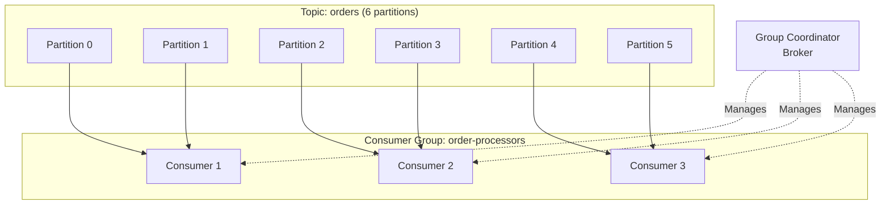
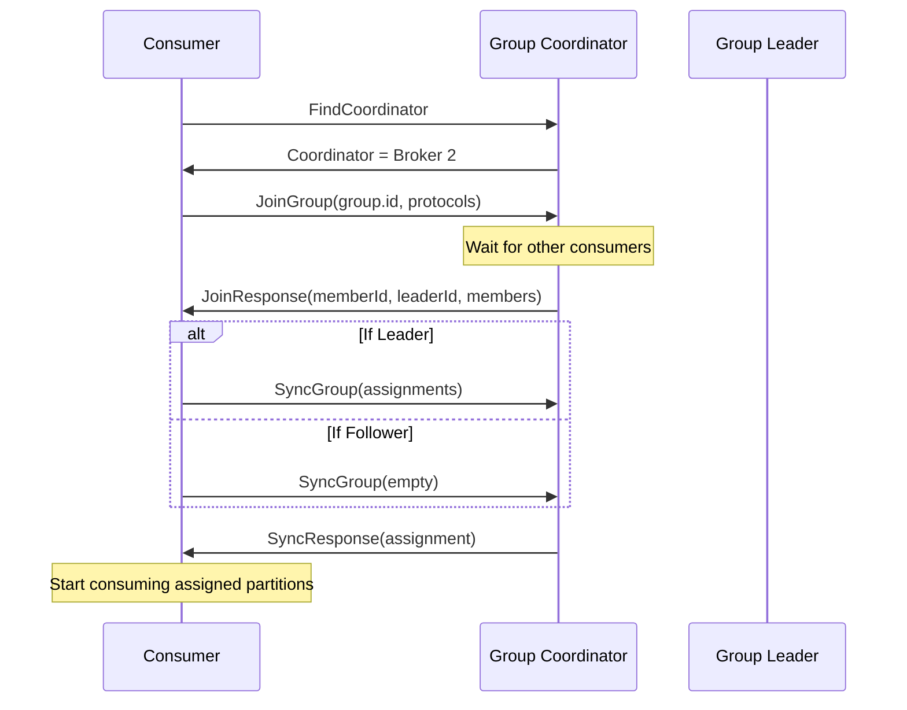
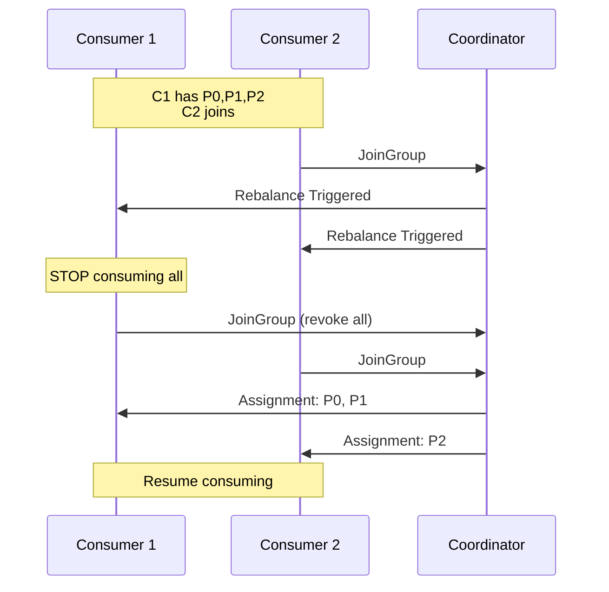
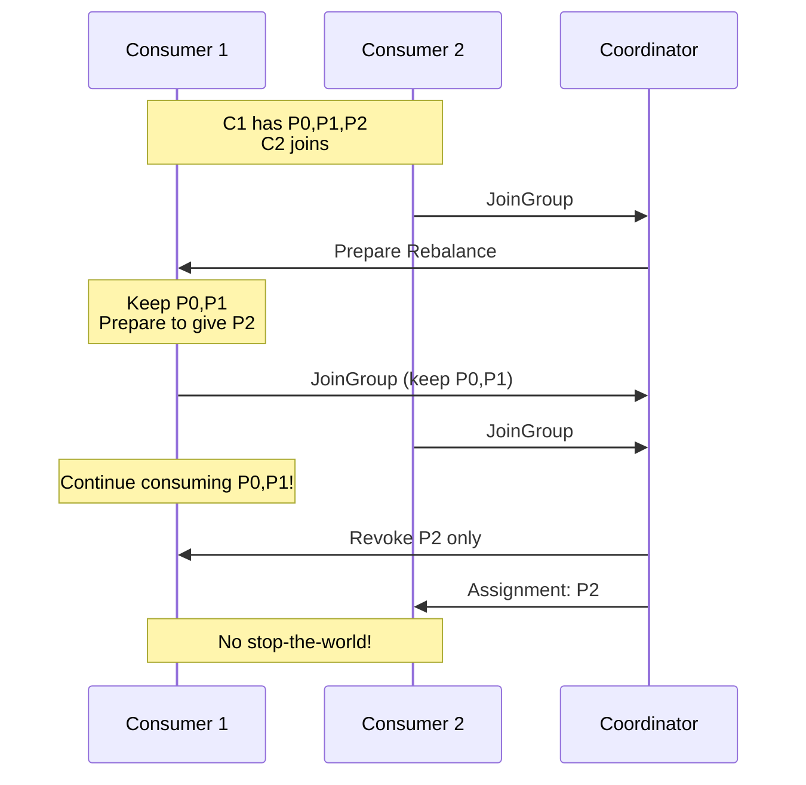

# Chapter 4: Consumer Internals

Understanding Kafka consumer internals is crucial for building reliable, scalable consuming applications. This chapter explores consumer groups, partition assignment, offset management, and rebalancing protocols.

## Learning Objectives

By the end of this chapter, you will:
- Understand consumer group mechanics and coordination
- Know different partition assignment strategies
- Master offset management (auto vs manual commit)
- Implement custom rebalance listeners
- Understand and handle rebalancing protocols

## Consumer Architecture Overview



## Consumer Group Mechanics

### Group Coordinator

Every consumer group has a **Group Coordinator** (a broker) that:
- Manages group membership
- Handles join/leave requests
- Triggers rebalances
- Stores committed offsets



### Heartbeats and Session Timeout

```yaml
# Consumer configuration
session.timeout.ms: 45000      # Max time between heartbeats
heartbeat.interval.ms: 3000    # Heartbeat frequency
max.poll.interval.ms: 300000   # Max time between polls
```

**Important distinction:**
- `session.timeout.ms`: Broker considers consumer dead if no heartbeat received
- `max.poll.interval.ms`: Consumer considered stuck if no poll() called

## Partition Assignment Strategies

### 1. Range Assignor (default before 2.4)

Assigns partitions per-topic in ranges:

```
Topic: orders (6 partitions)
Consumers: C1, C2

Assignment:
C1: orders-0, orders-1, orders-2
C2: orders-3, orders-4, orders-5
```

**Pros**: Predictable
**Cons**: Uneven distribution with multiple topics

### 2. RoundRobin Assignor

Distributes all partitions across all consumers:

```
Topics: orders (3p), payments (3p)
Consumers: C1, C2

Assignment:
C1: orders-0, orders-2, payments-1
C2: orders-1, payments-0, payments-2
```

**Pros**: Even distribution
**Cons**: More partition movement during rebalance

### 3. Sticky Assignor

Minimizes partition movement during rebalance:

```
Initial:
C1: orders-0, orders-1, payments-0
C2: orders-2, payments-1, payments-2

After C3 joins:
C1: orders-0, payments-0         # Kept existing where possible
C2: orders-2, payments-2         # Kept existing where possible
C3: orders-1, payments-1         # New consumer gets moved partitions
```

**Pros**: Minimal disruption, better for stateful consumers
**Cons**: Slightly more complex

### 4. Cooperative Sticky (recommended)

Same as sticky but with cooperative rebalancing (incremental):

```java
props.put(ConsumerConfig.PARTITION_ASSIGNMENT_STRATEGY_CONFIG,
    CooperativeStickyAssignor.class.getName());
```

## Offset Management

### Offset Storage

```mermaid
graph LR
    subgraph "Consumer"
        C[Consumer Instance]
        LC[Local Offset Cache]
    end

    subgraph "Kafka"
        CO[__consumer_offsets<br/>Internal Topic]
    end

    C -->|poll()| LC
    C -->|commit| CO
    CO -->|read on restart| LC
```

### Auto Commit

```yaml
spring:
  kafka:
    consumer:
      enable-auto-commit: true
      auto-commit-interval: 5000   # Commit every 5 seconds
```

**Problem**: Messages may be processed but not committed, or committed but not processed.

### Manual Commit Strategies

**1. Synchronous Commit (after each batch)**
```java
@KafkaListener(topics = "orders")
public void processOrders(List<Order> orders, Acknowledgment ack) {
    for (Order order : orders) {
        processOrder(order);
    }
    ack.acknowledge(); // Commit all offsets
}
```

**2. Per-Record Acknowledge**
```java
@KafkaListener(topics = "orders",
    containerFactory = "ackModeRecordFactory")
public void processOrder(Order order, Acknowledgment ack) {
    processOrder(order);
    ack.acknowledge(); // Commit this record's offset
}
```

**3. Manual with Offset Tracking**
```java
@KafkaListener(topics = "orders")
public void processWithManualCommit(
        ConsumerRecord<String, Order> record,
        Consumer<?, ?> consumer) {

    processOrder(record.value());

    // Commit specific offset
    consumer.commitSync(Map.of(
        new TopicPartition(record.topic(), record.partition()),
        new OffsetAndMetadata(record.offset() + 1)
    ));
}
```

## Rebalancing Protocols

### Eager Rebalancing (Legacy)



**Problem**: Complete stop-the-world during rebalance

### Cooperative Rebalancing (Incremental)



## Custom Rebalance Listener

```java
/**
 * Custom rebalance listener for stateful consumers.
 *
 * Use cases:
 * - Save state before partitions are revoked
 * - Initialize state when partitions are assigned
 * - Commit offsets precisely before revocation
 */
public class StatefulRebalanceListener implements ConsumerRebalanceListener {

    private final Consumer<?, ?> consumer;
    private final StateStore stateStore;

    @Override
    public void onPartitionsRevoked(Collection<TopicPartition> partitions) {
        log.info("Partitions revoked: {}", partitions);

        // 1. Commit any pending offsets
        consumer.commitSync();

        // 2. Save state for revoked partitions
        for (TopicPartition partition : partitions) {
            stateStore.saveState(partition);
        }

        log.info("State saved for {} partitions", partitions.size());
    }

    @Override
    public void onPartitionsAssigned(Collection<TopicPartition> partitions) {
        log.info("Partitions assigned: {}", partitions);

        // Load state for newly assigned partitions
        for (TopicPartition partition : partitions) {
            stateStore.loadState(partition);
        }

        log.info("State loaded for {} partitions", partitions.size());
    }

    @Override
    public void onPartitionsLost(Collection<TopicPartition> partitions) {
        // Called during cooperative rebalance when partitions
        // are lost without clean revocation
        log.warn("Partitions lost (not cleanly revoked): {}", partitions);

        // State may be inconsistent - handle appropriately
        for (TopicPartition partition : partitions) {
            stateStore.markStateAsStale(partition);
        }
    }
}
```

## Hands-On Lab

### Step 1: Start Infrastructure

```bash
cd ../infrastructure
docker-compose up -d
```

### Step 2: Run the Application

```bash
cd ../chapter-04-consumer-internals
mvn spring-boot:run
```

### Step 3: Observe Consumer Group

```bash
# In another terminal, produce messages
docker exec -it kafka kafka-console-producer \
  --bootstrap-server localhost:9092 \
  --topic consumer.demo

# Check consumer group
docker exec kafka kafka-consumer-groups \
  --bootstrap-server localhost:9092 \
  --describe --group chapter04-group
```

### Step 4: Trigger Rebalance

```bash
# Start a second instance
SERVER_PORT=8081 mvn spring-boot:run

# Watch logs for rebalance events
# Observe partition reassignment
```

### Step 5: Test Manual Commits

```bash
# Enable manual commit mode
curl -X POST "http://localhost:8080/api/consumer/config?autoCommit=false"

# Send messages and observe commit behavior
curl "http://localhost:8080/api/consumer/stats"
```

## Key Configuration Parameters

| Parameter | Default | Description |
|-----------|---------|-------------|
| `group.id` | - | Consumer group identifier |
| `auto.offset.reset` | latest | Where to start if no committed offset |
| `enable.auto.commit` | true | Auto-commit offsets periodically |
| `max.poll.records` | 500 | Max records per poll() |
| `max.poll.interval.ms` | 300000 | Max time between polls |
| `session.timeout.ms` | 45000 | Session timeout |
| `heartbeat.interval.ms` | 3000 | Heartbeat frequency |
| `partition.assignment.strategy` | RangeAssignor | Assignment strategy |

## Best Practices

### 1. Use Cooperative Rebalancing

```java
props.put(ConsumerConfig.PARTITION_ASSIGNMENT_STRATEGY_CONFIG,
    CooperativeStickyAssignor.class.getName());
```

### 2. Tune Poll Interval

```java
// If processing takes long, increase this
props.put(ConsumerConfig.MAX_POLL_INTERVAL_MS_CONFIG, 600000);

// Or reduce records per poll
props.put(ConsumerConfig.MAX_POLL_RECORDS_CONFIG, 100);
```

### 3. Handle Rebalance Properly

```java
// Always implement rebalance listener for production
factory.setConsumerRebalanceListener(new LoggingRebalanceListener());
```

### 4. Commit Strategy

```java
// For exactly-once: manual commit after processing
// For at-least-once: auto-commit or commit before processing
// For at-most-once: commit before processing (not recommended)
```

## Interview Questions

### Beginner
1. **Q**: What is a consumer group and why is it important?
   **A**: A consumer group is a set of consumers that cooperate to consume from topics. Each partition is consumed by exactly one consumer in the group, enabling parallel processing. Multiple groups can consume the same topic independently (pub/sub pattern).

2. **Q**: What happens when a new consumer joins a group?
   **A**: A rebalance is triggered. The group coordinator notifies all consumers, they rejoin the group, and partitions are reassigned. With eager rebalancing, all consumers stop during this process. With cooperative rebalancing, only affected partitions are redistributed.

### Intermediate
3. **Q**: Explain the difference between `session.timeout.ms` and `max.poll.interval.ms`.
   **A**: `session.timeout.ms` controls how long the broker waits for heartbeats - if exceeded, the consumer is considered dead. `max.poll.interval.ms` controls how long between poll() calls - if exceeded, the consumer is considered stuck and leaves the group. The heartbeat thread handles session timeout; poll() calls handle max poll interval.

4. **Q**: When would you use manual offset commit?
   **A**: Manual commit is necessary when: (1) you need exactly-once semantics with external systems, (2) you're doing batch processing and want to commit after each batch, (3) you need to control exactly when offsets are committed to avoid data loss or duplicates.

### Advanced
5. **Q**: Explain cooperative rebalancing and why it's better than eager rebalancing.
   **A**: Cooperative rebalancing (incremental) allows consumers to continue processing partitions that aren't being moved during a rebalance. Only affected partitions are revoked and reassigned. This reduces "stop-the-world" pauses, improves availability, and is especially important for stateful consumers that need to save/restore state.

6. **Q**: How would you implement exactly-once consumption with an external database?
   **A**: Store the Kafka offset alongside the business data in the same database transaction. On restart, query the database for the last processed offset and seek to that position. This ensures atomicity between processing and offset tracking. Example: `INSERT INTO results (data) VALUES (?); INSERT INTO offsets (partition, offset) VALUES (?, ?) ON CONFLICT UPDATE`.

## References

- [Kafka Consumer Configs](https://kafka.apache.org/documentation/#consumerconfigs)
- [KIP-429: Incremental Rebalance Protocol](https://cwiki.apache.org/confluence/display/KAFKA/KIP-429)
- [Consumer Group Protocol](https://kafka.apache.org/protocol#consumer_group)

## Next Chapter

Continue to [Chapter 5: Spring Kafka Foundations](../chapter-05-spring-kafka-foundations/README.md) to learn how Spring Kafka simplifies Kafka integration.
