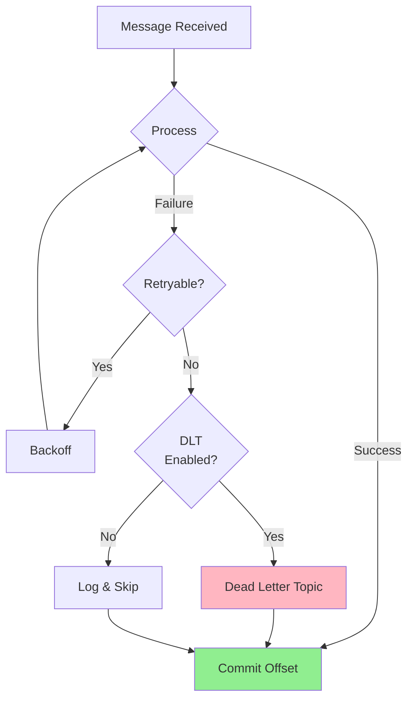
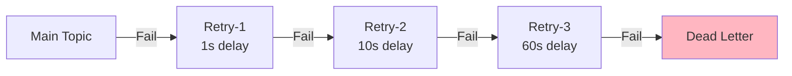

# Chapter 6: Error Handling Patterns

Building resilient Kafka consumers requires proper error handling. This chapter covers Spring Kafka's error handling mechanisms, dead letter topics, retry strategies, and circuit breaker integration.

## Learning Objectives

By the end of this chapter, you will:
- Configure `DefaultErrorHandler` for various error scenarios
- Implement Dead Letter Topics (DLT) for poison messages
- Use retry with exponential backoff
- Integrate circuit breakers with Resilience4j
- Handle both transient and permanent failures appropriately

## Error Handling Architecture



## DefaultErrorHandler

Spring Kafka's `DefaultErrorHandler` provides sophisticated error handling:

```java
@Configuration
public class ErrorHandlerConfig {

    @Bean
    public DefaultErrorHandler errorHandler(KafkaTemplate<String, Object> kafkaTemplate) {
        // Configure Dead Letter Topic publishing
        DeadLetterPublishingRecoverer recoverer = new DeadLetterPublishingRecoverer(
            kafkaTemplate,
            (record, ex) -> new TopicPartition(record.topic() + ".DLT", record.partition())
        );

        // Retry configuration with exponential backoff
        ExponentialBackOff backOff = new ExponentialBackOff(1000L, 2.0);
        backOff.setMaxElapsedTime(60000L);  // Max 60 seconds total

        DefaultErrorHandler handler = new DefaultErrorHandler(recoverer, backOff);

        // Don't retry on certain exceptions (they won't succeed)
        handler.addNotRetryableExceptions(
            DeserializationException.class,
            ValidationException.class,
            NullPointerException.class
        );

        // Log retry attempts
        handler.setRetryListeners((record, ex, deliveryAttempt) ->
            log.warn("Retry attempt {} for record: {}", deliveryAttempt, record.key())
        );

        return handler;
    }
}
```

## Dead Letter Topics (DLT)

### Basic DLT Setup

```java
@Configuration
public class DltConfig {

    @Bean
    public DeadLetterPublishingRecoverer deadLetterPublishingRecoverer(
            KafkaTemplate<Object, Object> template) {

        return new DeadLetterPublishingRecoverer(template, (record, exception) -> {
            // Custom DLT topic naming
            String dltTopic = record.topic() + ".DLT";

            log.error("Sending to DLT: topic={}, key={}, error={}",
                dltTopic, record.key(), exception.getMessage());

            return new TopicPartition(dltTopic, -1);  // -1 = use default partitioning
        });
    }
}
```

### DLT Consumer

```java
@Component
public class DltConsumer {

    @KafkaListener(topics = "payments.DLT", groupId = "dlt-processor")
    public void processDlt(
            ConsumerRecord<String, String> record,
            @Header(KafkaHeaders.EXCEPTION_FQCN) String exceptionType,
            @Header(KafkaHeaders.EXCEPTION_MESSAGE) String exceptionMessage,
            @Header(KafkaHeaders.ORIGINAL_TOPIC) String originalTopic) {

        log.error("DLT received - Original topic: {}, Key: {}, Exception: {} - {}",
            originalTopic, record.key(), exceptionType, exceptionMessage);

        // Store for manual review
        dltRepository.save(DltRecord.from(record, exceptionType, exceptionMessage));

        // Alert operations team
        alertService.sendDltAlert(record, exceptionMessage);
    }
}
```

## Retry Strategies

### Fixed Backoff

```java
new FixedBackOff(1000L, 3L)  // 1 second delay, max 3 retries
```

### Exponential Backoff

```java
ExponentialBackOff backOff = new ExponentialBackOff();
backOff.setInitialInterval(1000);   // 1 second initial
backOff.setMultiplier(2.0);          // Double each time
backOff.setMaxInterval(30000);       // Max 30 seconds
backOff.setMaxElapsedTime(120000);   // Give up after 2 minutes
```

### Custom Backoff

```java
public class JitteredBackOff implements BackOff {

    private final long initialInterval;
    private final double multiplier;
    private final long maxInterval;

    @Override
    public BackOffExecution start() {
        return new BackOffExecution() {
            private int attempt = 0;

            @Override
            public long nextBackOff() {
                long interval = (long) (initialInterval * Math.pow(multiplier, attempt++));
                interval = Math.min(interval, maxInterval);

                // Add jitter to prevent thundering herd
                long jitter = ThreadLocalRandom.current().nextLong(interval / 4);
                return interval + jitter;
            }
        };
    }
}
```

## Circuit Breaker Integration

### Configuration

```java
@Configuration
public class CircuitBreakerConfig {

    @Bean
    public CircuitBreakerRegistry circuitBreakerRegistry() {
        CircuitBreakerConfig config = CircuitBreakerConfig.custom()
            .failureRateThreshold(50)                // Open when 50% fail
            .waitDurationInOpenState(Duration.ofSeconds(30))
            .permittedNumberOfCallsInHalfOpenState(3)
            .minimumNumberOfCalls(10)
            .build();

        return CircuitBreakerRegistry.of(config);
    }
}
```

### Consumer with Circuit Breaker

```java
@Service
public class PaymentProcessor {

    private final CircuitBreaker circuitBreaker;
    private final PaymentGateway paymentGateway;

    @KafkaListener(topics = "payments", groupId = "payment-processor")
    public void processPayment(Payment payment) {
        try {
            // External call protected by circuit breaker
            CircuitBreaker.decorateSupplier(circuitBreaker,
                () -> paymentGateway.process(payment)
            ).get();

        } catch (CallNotPermittedException e) {
            // Circuit is open - throw to trigger Kafka retry
            log.warn("Circuit breaker open, will retry later");
            throw new RetryableException("Circuit breaker open", e);
        }
    }
}
```

## Handling Different Error Types

### Classifying Exceptions

```java
@Configuration
public class ErrorClassificationConfig {

    @Bean
    public DefaultErrorHandler errorHandler(DeadLetterPublishingRecoverer recoverer) {
        DefaultErrorHandler handler = new DefaultErrorHandler(recoverer, new FixedBackOff(1000, 3));

        // Permanent failures - no retry, go straight to DLT
        handler.addNotRetryableExceptions(
            DeserializationException.class,    // Bad message format
            ValidationException.class,          // Invalid data
            SecurityException.class,            // Auth failures
            IllegalArgumentException.class      // Business rule violations
        );

        // Retryable failures - these might succeed on retry
        // (Default - all other exceptions are retried)

        return handler;
    }
}
```

### Custom Exception Classifier

```java
public class PaymentExceptionClassifier {

    public static boolean isRetryable(Exception ex) {
        if (ex instanceof PaymentGatewayException pge) {
            return switch (pge.getErrorCode()) {
                case "TIMEOUT", "SERVICE_UNAVAILABLE", "RATE_LIMITED" -> true;
                case "INVALID_CARD", "INSUFFICIENT_FUNDS", "FRAUD_DETECTED" -> false;
                default -> false;
            };
        }
        return ex instanceof IOException || ex instanceof TimeoutException;
    }
}
```

## Non-Blocking Retry

For high-throughput scenarios, use separate retry topics:



```java
@RetryableTopic(
    attempts = "4",
    backoff = @Backoff(delay = 1000, multiplier = 10, maxDelay = 60000),
    dltTopicSuffix = ".DLT",
    autoCreateTopics = "true"
)
@KafkaListener(topics = "payments", groupId = "payment-processor")
public void processPayment(Payment payment) {
    paymentService.process(payment);
}

@DltHandler
public void handleDlt(Payment payment, @Header(KafkaHeaders.EXCEPTION_MESSAGE) String error) {
    log.error("Payment failed after all retries: {}, error: {}", payment.paymentId(), error);
}
```

## Hands-On Lab

### Step 1: Start Infrastructure

```bash
cd ../infrastructure
docker-compose up -d
```

### Step 2: Run the Application

```bash
cd ../chapter-06-error-handling
mvn spring-boot:run
```

### Step 3: Test Error Handling

```bash
# Send valid payment
curl -X POST http://localhost:8080/api/payments \
  -H "Content-Type: application/json" \
  -d '{"paymentId": "pay-1", "amount": 100.00}'

# Send invalid payment (triggers DLT)
curl -X POST http://localhost:8080/api/payments \
  -H "Content-Type: application/json" \
  -d '{"paymentId": "INVALID", "amount": -100}'

# Check DLT
docker exec kafka kafka-console-consumer \
  --bootstrap-server localhost:9092 \
  --topic payments.DLT --from-beginning
```

## Best Practices

### 1. Classify Exceptions Properly

```java
// Know which exceptions are retryable
handler.addNotRetryableExceptions(ValidationException.class);
```

### 2. Set Appropriate Retry Limits

```java
// Don't retry forever - have a reasonable limit
new FixedBackOff(1000, 5)  // Max 5 retries
```

### 3. Monitor DLT Topics

```java
@Scheduled(fixedRate = 60000)
public void checkDltBacklog() {
    long count = dltRepository.countPendingMessages();
    if (count > threshold) {
        alertService.alert("DLT backlog exceeded: " + count);
    }
}
```

### 4. Include Context in DLT Messages

```java
// Headers help with debugging
record.headers().add("original-topic", originalTopic.getBytes());
record.headers().add("exception-type", exceptionClass.getBytes());
record.headers().add("exception-message", exceptionMessage.getBytes());
```

## Interview Questions

### Beginner
1. **Q**: What is a Dead Letter Topic and when would you use one?
   **A**: A DLT is a topic where messages that fail processing are sent. It's used when you can't process a message after all retries and need to preserve it for manual review or later reprocessing.

### Intermediate
2. **Q**: What's the difference between `SeekToCurrentErrorHandler` (deprecated) and `DefaultErrorHandler`?
   **A**: `DefaultErrorHandler` (Kafka 2.8+) is the replacement. It supports non-blocking retries, better backoff strategies, and improved retry topic integration. `SeekToCurrentErrorHandler` is deprecated.

### Advanced
3. **Q**: How would you implement idempotent error handling?
   **A**: Store a deduplication key (message ID + partition + offset) before processing. On retry, check if already processed. Use transactions to atomically store the key and process the message.

## References

- [Spring Kafka Error Handling](https://docs.spring.io/spring-kafka/docs/current/reference/html/#error-handling)
- [Non-Blocking Retries](https://docs.spring.io/spring-kafka/docs/current/reference/html/#retry-topic)

## Next Chapter

Continue to [Chapter 7: Transactions and Exactly-Once](../chapter-07-transactions/README.md) to learn transactional messaging.
