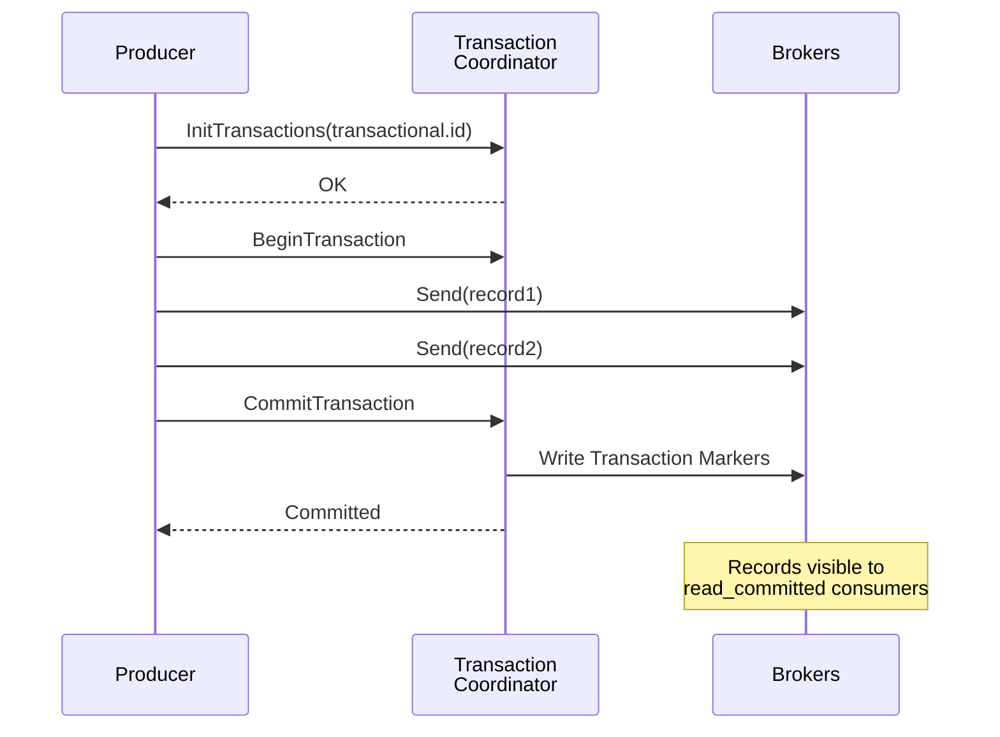
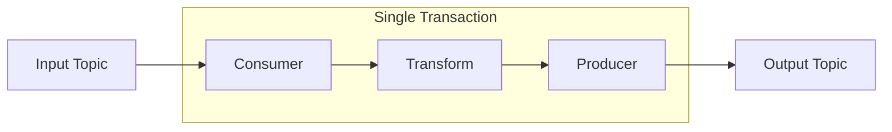
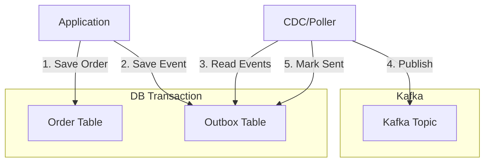

# Chapter 7: Transactions and Exactly-Once

This chapter covers Kafka transactions, exactly-once semantics (EOS), and how to coordinate Kafka with database transactions.

## Learning Objectives

By the end of this chapter, you will:
- Understand Kafka's transactional architecture
- Implement transactional producers in Spring
- Use the consume-transform-produce pattern
- Coordinate Kafka and database transactions
- Understand transaction isolation levels

## Transactional Architecture



## Exactly-Once Semantics (EOS)

### What EOS Guarantees

| Guarantee | Description |
|-----------|-------------|
| **No Duplicates** | Each message processed exactly once |
| **No Data Loss** | Committed messages survive failures |
| **Atomic Writes** | All messages in transaction succeed or fail together |

### Configuration

```java
@Configuration
public class TransactionalKafkaConfig {

    @Bean
    public ProducerFactory<String, Object> producerFactory() {
        Map<String, Object> props = new HashMap<>();
        props.put(ProducerConfig.BOOTSTRAP_SERVERS_CONFIG, "localhost:9092");

        // Enable transactions
        props.put(ProducerConfig.TRANSACTIONAL_ID_CONFIG, "order-tx-");

        // Idempotence required for transactions
        props.put(ProducerConfig.ENABLE_IDEMPOTENCE_CONFIG, true);

        // Wait for all replicas
        props.put(ProducerConfig.ACKS_CONFIG, "all");

        return new DefaultKafkaProducerFactory<>(props);
    }

    @Bean
    public KafkaTransactionManager<String, Object> kafkaTransactionManager(
            ProducerFactory<String, Object> producerFactory) {
        return new KafkaTransactionManager<>(producerFactory);
    }
}
```

## Transactional Producer

### Basic Usage

```java
@Service
public class TransactionalOrderService {

    private final KafkaTemplate<String, Object> kafkaTemplate;

    @Transactional("kafkaTransactionManager")
    public void processOrder(Order order) {
        // All sends are part of the same transaction
        kafkaTemplate.send("order.created", order.orderId(), order);
        kafkaTemplate.send("inventory.reserve", order.orderId(), toInventoryCommand(order));
        kafkaTemplate.send("payment.process", order.orderId(), toPaymentCommand(order));
        // Transaction commits when method completes successfully
    }
}
```

### Programmatic Transactions

```java
public void processWithExplicitTransaction(Order order) {
    kafkaTemplate.executeInTransaction(template -> {
        template.send("orders", order);
        template.send("audit", toAuditEvent(order));
        return null;
    });
}
```

## Consume-Transform-Produce Pattern



### Implementation

```java
@Service
public class OrderEnricherService {

    private final KafkaTemplate<String, EnrichedOrder> kafkaTemplate;

    @KafkaListener(topics = "orders.raw", groupId = "order-enricher")
    @Transactional("kafkaTransactionManager")
    public void enrichOrder(
            @Payload Order order,
            @Header(KafkaHeaders.RECEIVED_KEY) String key,
            Acknowledgment ack) {

        // Transform
        EnrichedOrder enriched = enrichWithCustomerData(order);

        // Produce (same transaction as consume)
        kafkaTemplate.send("orders.enriched", key, enriched);

        // Offset committed with transaction
        ack.acknowledge();
    }
}
```

## Database + Kafka Transactions

### Challenge

Database and Kafka have separate transaction managers. True atomic commits require careful coordination.

### Pattern: Outbox Table



### Implementation

```java
@Service
public class OutboxOrderService {

    private final OrderRepository orderRepository;
    private final OutboxRepository outboxRepository;

    @Transactional  // Database transaction
    public Order createOrder(CreateOrderCommand command) {
        // Save order
        Order order = orderRepository.save(new Order(command));

        // Save event to outbox (same DB transaction)
        outboxRepository.save(new OutboxEvent(
            "OrderCreated",
            order.getId(),
            toJson(order)
        ));

        return order;
    }
}

@Component
public class OutboxPoller {

    @Scheduled(fixedRate = 100)
    @Transactional
    public void publishPendingEvents() {
        List<OutboxEvent> events = outboxRepository.findUnpublished(100);

        for (OutboxEvent event : events) {
            kafkaTemplate.send("orders", event.getAggregateId(), event.getPayload());
            event.markPublished();
        }
    }
}
```

## Transaction Isolation

### Consumer Isolation Levels

```java
// Read all messages (including uncommitted)
props.put(ConsumerConfig.ISOLATION_LEVEL_CONFIG, "read_uncommitted");

// Read only committed messages (default for transactional consumers)
props.put(ConsumerConfig.ISOLATION_LEVEL_CONFIG, "read_committed");
```

### Visibility

```
Producer Transaction Timeline:
    |------- Transaction 1 -------|
    send(A) send(B) send(C)    COMMIT

read_uncommitted consumer: sees A, B, C immediately
read_committed consumer: sees nothing until COMMIT, then sees A, B, C
```

## Hands-On Lab

### Step 1: Start Infrastructure

```bash
cd ../infrastructure
docker-compose up -d
```

### Step 2: Run the Application

```bash
cd ../chapter-07-transactions
mvn spring-boot:run
```

### Step 3: Test Transactions

```bash
# Create transactional order
curl -X POST http://localhost:8080/api/orders/transactional \
  -H "Content-Type: application/json" \
  -d '{"customerId": "cust-1", "items": [{"productId": "prod-1", "quantity": 2}]}'

# Verify all topics received messages atomically
docker exec kafka kafka-console-consumer \
  --bootstrap-server localhost:9092 \
  --topic order.created --from-beginning

docker exec kafka kafka-console-consumer \
  --bootstrap-server localhost:9092 \
  --topic inventory.reserve --from-beginning
```

## Best Practices

### 1. Use Unique Transactional IDs

```java
// Include instance identifier for uniqueness
String txId = "order-service-" + instanceId + "-";
props.put(ProducerConfig.TRANSACTIONAL_ID_CONFIG, txId);
```

### 2. Handle Transaction Timeouts

```java
props.put(ProducerConfig.TRANSACTION_TIMEOUT_CONFIG, 60000);  // 60 seconds
```

### 3. Monitor Transaction State

```java
// Log transaction outcomes
kafkaTemplate.executeInTransaction(template -> {
    try {
        // ... operations
        metrics.incrementTransactionSuccess();
    } catch (Exception e) {
        metrics.incrementTransactionFailure();
        throw e;
    }
    return null;
});
```

## Interview Questions

### Beginner
1. **Q**: What is exactly-once semantics in Kafka?
   **A**: EOS ensures each message is processed exactly once, even with failures and retries. It combines idempotent producers (no duplicates from retries), transactional producers (atomic multi-partition writes), and read_committed consumers.

### Intermediate
2. **Q**: Why can't you use Kafka transactions with external databases atomically?
   **A**: Kafka and databases have separate transaction managers with no two-phase commit protocol between them. You need patterns like the outbox pattern to achieve eventual consistency.

### Advanced
3. **Q**: How do Kafka transactions work internally?
   **A**: The producer gets a PID and registers with the Transaction Coordinator. Each transaction has a unique txn.id. The coordinator writes PREPARE markers, then COMMIT/ABORT markers. Consumers with read_committed filter out uncommitted or aborted messages using these markers.

## References

- [KIP-98: Exactly Once Delivery](https://cwiki.apache.org/confluence/display/KAFKA/KIP-98)
- [Kafka Transactions Documentation](https://kafka.apache.org/documentation/#semantics)
- [Spring Kafka Transactions](https://docs.spring.io/spring-kafka/docs/current/reference/html/#transactions)

## Next Chapter

Continue to [Chapter 8: Testing Strategies](../chapter-08-testing-strategies/README.md) to learn comprehensive testing approaches.
