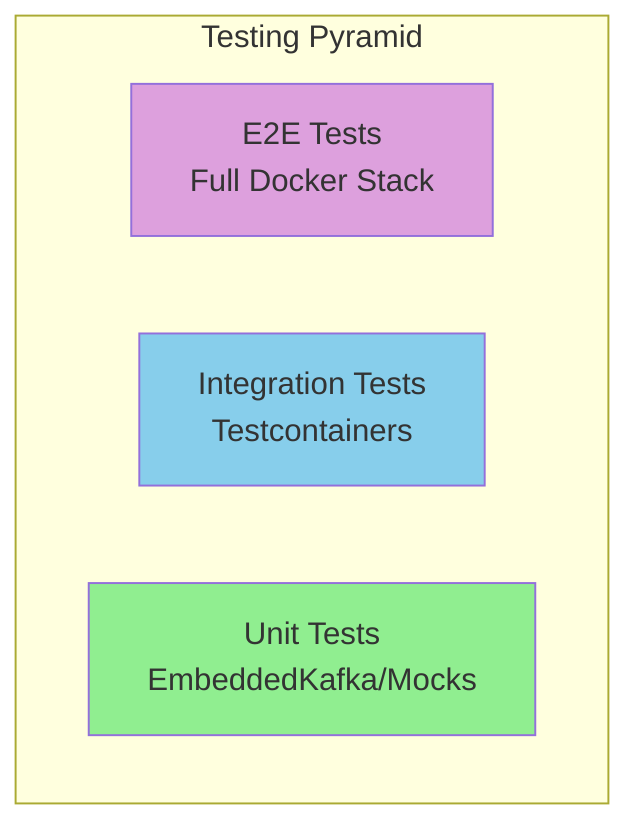

# Chapter 8: Testing Strategies

Comprehensive testing is crucial for Kafka applications. This chapter covers unit testing with EmbeddedKafka, integration testing with Testcontainers, and patterns for testing async consumers.

## Learning Objectives

By the end of this chapter, you will:
- Write unit tests with `@EmbeddedKafka`
- Create integration tests with Testcontainers
- Test async consumers using Awaitility
- Mock Kafka for isolated unit tests
- Build a comprehensive test suite

## Testing Pyramid for Kafka



## EmbeddedKafka

### Basic Setup

```java
@SpringBootTest
@EmbeddedKafka(
    partitions = 3,
    topics = {"test-orders", "test-payments"},
    brokerProperties = {
        "listeners=PLAINTEXT://localhost:9092",
        "auto.create.topics.enable=true"
    }
)
class OrderServiceEmbeddedTest {

    @Autowired
    private KafkaTemplate<String, Order> kafkaTemplate;

    @Autowired
    private EmbeddedKafkaBroker embeddedKafka;

    @Test
    void shouldProduceOrder() throws Exception {
        Order order = new Order("order-1", "customer-1", List.of());

        kafkaTemplate.send("test-orders", order.orderId(), order).get();

        // Consumer to verify
        Consumer<String, Order> consumer = createConsumer();
        embeddedKafka.consumeFromEmbeddedTopics(consumer, "test-orders");

        ConsumerRecords<String, Order> records = consumer.poll(Duration.ofSeconds(10));
        assertThat(records.count()).isEqualTo(1);
    }
}
```

### Testing Listeners

```java
@SpringBootTest
@EmbeddedKafka(topics = "orders")
class OrderConsumerTest {

    @Autowired
    private KafkaTemplate<String, Order> kafkaTemplate;

    @SpyBean
    private OrderProcessor orderProcessor;

    @Test
    void shouldProcessOrder() {
        Order order = TestData.createOrder();

        kafkaTemplate.send("orders", order.orderId(), order);

        await().atMost(Duration.ofSeconds(10))
            .untilAsserted(() ->
                verify(orderProcessor).process(any(Order.class))
            );
    }
}
```

## Testcontainers

### Basic Setup

```java
@SpringBootTest
@Testcontainers
class OrderServiceIntegrationTest {

    @Container
    static KafkaContainer kafka = new KafkaContainer(
        DockerImageName.parse("confluentinc/cp-kafka:7.6.0")
    );

    @DynamicPropertySource
    static void kafkaProperties(DynamicPropertyRegistry registry) {
        registry.add("spring.kafka.bootstrap-servers", kafka::getBootstrapServers);
    }

    @Test
    void shouldProcessOrderEndToEnd() {
        // Test with real Kafka
    }
}
```

### Shared Container

```java
abstract class BaseIntegrationTest {

    @Container
    protected static final KafkaContainer KAFKA = new KafkaContainer(
        DockerImageName.parse("confluentinc/cp-kafka:7.6.0")
    ).withReuse(true);  // Reuse between tests

    @DynamicPropertySource
    static void kafkaProperties(DynamicPropertyRegistry registry) {
        registry.add("spring.kafka.bootstrap-servers", KAFKA::getBootstrapServers);
    }
}

class OrderServiceTest extends BaseIntegrationTest {
    // Tests...
}

class PaymentServiceTest extends BaseIntegrationTest {
    // Tests share the same Kafka container
}
```

## Awaitility for Async Testing

### Basic Usage

```java
@Test
void shouldEventuallyProcessMessage() {
    kafkaTemplate.send("orders", order);

    await()
        .atMost(Duration.ofSeconds(30))
        .pollInterval(Duration.ofMillis(500))
        .untilAsserted(() ->
            assertThat(orderRepository.findById(order.orderId()))
                .isPresent()
        );
}
```

### Advanced Patterns

```java
@Test
void shouldProcessAllMessages() {
    List<Order> orders = IntStream.range(0, 100)
        .mapToObj(i -> TestData.createOrder("order-" + i))
        .toList();

    orders.forEach(o -> kafkaTemplate.send("orders", o.orderId(), o));

    // Wait for all to be processed
    await()
        .atMost(Duration.ofMinutes(1))
        .pollInterval(Duration.ofSeconds(1))
        .until(() -> processedCount.get() == 100);

    // Verify results
    orders.forEach(order ->
        assertThat(orderRepository.findById(order.orderId())).isPresent()
    );
}
```

## Mocking Strategies

### Mock Producer

```java
@ExtendWith(MockitoExtension.class)
class OrderServiceUnitTest {

    @Mock
    private KafkaTemplate<String, Order> kafkaTemplate;

    @InjectMocks
    private OrderService orderService;

    @Test
    void shouldSendOrder() {
        Order order = TestData.createOrder();

        when(kafkaTemplate.send(anyString(), anyString(), any(Order.class)))
            .thenReturn(CompletableFuture.completedFuture(null));

        orderService.createOrder(order);

        verify(kafkaTemplate).send(eq("orders"), eq(order.orderId()), eq(order));
    }
}
```

### Test Consumer

```java
@Component
@Profile("test")
public class TestOrderConsumer {

    private final List<Order> receivedOrders = new CopyOnWriteArrayList<>();

    @KafkaListener(topics = "orders")
    public void receive(Order order) {
        receivedOrders.add(order);
    }

    public List<Order> getReceivedOrders() {
        return List.copyOf(receivedOrders);
    }

    public void clear() {
        receivedOrders.clear();
    }
}
```

## Test Utilities

### Test Data Builder

```java
public class TestData {

    public static Order createOrder() {
        return createOrder("order-" + UUID.randomUUID());
    }

    public static Order createOrder(String orderId) {
        return new Order(
            orderId,
            "customer-1",
            List.of(new OrderItem("product-1", "Test Product", 1, BigDecimal.TEN)),
            BigDecimal.TEN,
            Order.OrderStatus.PENDING,
            Instant.now(),
            Instant.now()
        );
    }
}
```

### Kafka Test Helper

```java
@Component
public class KafkaTestHelper {

    private final EmbeddedKafkaBroker embeddedKafka;

    public <K, V> Consumer<K, V> createConsumer(
            Class<? extends Deserializer<K>> keyDeserializer,
            Class<? extends Deserializer<V>> valueDeserializer) {

        Map<String, Object> props = KafkaTestUtils.consumerProps(
            "test-group", "true", embeddedKafka
        );
        props.put(ConsumerConfig.KEY_DESERIALIZER_CLASS_CONFIG, keyDeserializer);
        props.put(ConsumerConfig.VALUE_DESERIALIZER_CLASS_CONFIG, valueDeserializer);

        return new DefaultKafkaConsumerFactory<K, V>(props).createConsumer();
    }

    public <K, V> List<V> consumeAll(String topic, Duration timeout) {
        Consumer<K, V> consumer = createConsumer(/* ... */);
        consumer.subscribe(List.of(topic));

        List<V> results = new ArrayList<>();
        Instant deadline = Instant.now().plus(timeout);

        while (Instant.now().isBefore(deadline)) {
            ConsumerRecords<K, V> records = consumer.poll(Duration.ofMillis(100));
            records.forEach(r -> results.add(r.value()));
        }

        return results;
    }
}
```

## Best Practices

### 1. Use Unique Topic Names

```java
@BeforeEach
void setup() {
    testTopic = "orders-" + UUID.randomUUID();
}
```

### 2. Clean Up After Tests

```java
@AfterEach
void cleanup() {
    adminClient.deleteTopics(List.of(testTopic)).all().get();
}
```

### 3. Use Appropriate Timeouts

```java
await()
    .atMost(Duration.ofSeconds(30))  // Reasonable max wait
    .pollInterval(Duration.ofMillis(100))  // Check frequently
    .untilAsserted(() -> /* assertion */);
```

## Interview Questions

1. **Q**: When would you use EmbeddedKafka vs Testcontainers?
   **A**: EmbeddedKafka for fast unit tests that need basic Kafka functionality. Testcontainers for integration tests requiring production-like Kafka behavior or additional components like Schema Registry.

2. **Q**: How do you test async Kafka consumers?
   **A**: Use Awaitility to poll for expected outcomes. Verify side effects (database writes, state changes) rather than trying to intercept messages directly.

## References

- [Spring Kafka Testing](https://docs.spring.io/spring-kafka/docs/current/reference/html/#testing)
- [Testcontainers Kafka Module](https://www.testcontainers.org/modules/kafka/)
- [Awaitility](http://www.awaitility.org/)

## Next Chapter

Continue to [Chapter 9: Event-Driven Architecture](../chapter-09-event-driven-architecture/README.md) to implement event sourcing and sagas.
