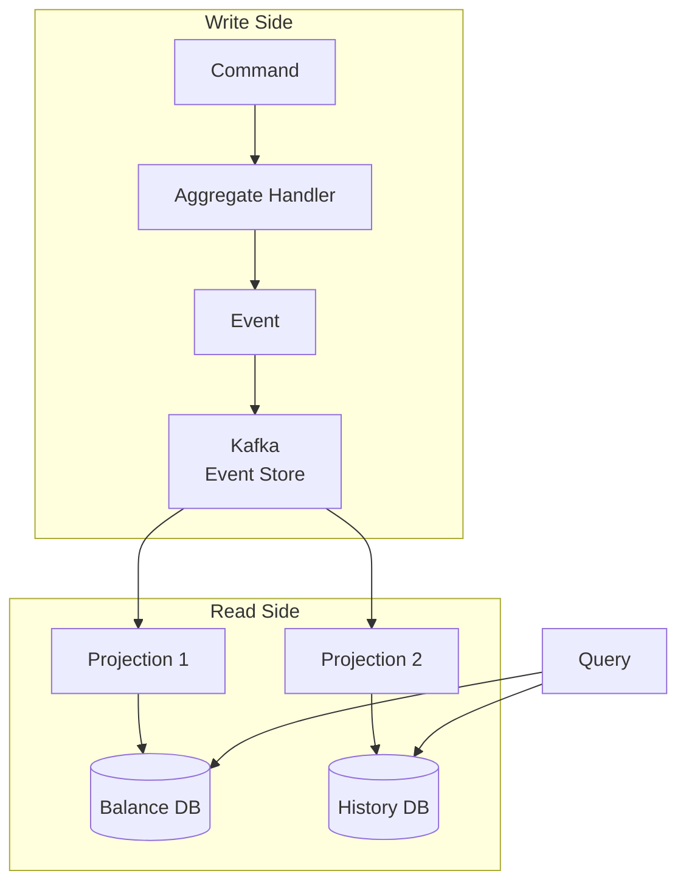
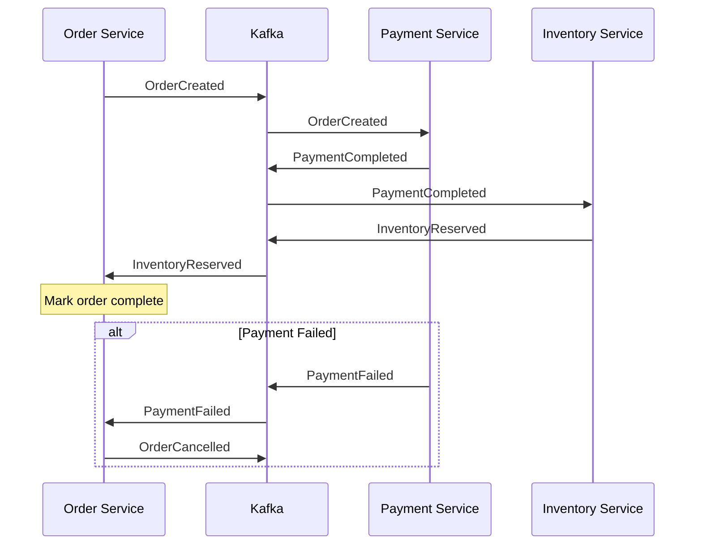

# Chapter 9: Event-Driven Architecture

This chapter covers event sourcing, CQRS (Command Query Responsibility Segregation), and the saga pattern using Kafka as the event store and message backbone.

## Learning Objectives

By the end of this chapter, you will:
- Understand event sourcing fundamentals
- Implement CQRS with separate read/write models
- Build sagas for distributed transactions
- Handle event versioning and upcasting

## Event Sourcing with Kafka



### Event Store Implementation

```java
public interface Event {
    String getAggregateId();
    String getEventType();
    Instant getTimestamp();
    int getVersion();
}

@Service
public class KafkaEventStore implements EventStore {

    private final KafkaTemplate<String, Event> kafkaTemplate;

    @Override
    @Transactional("kafkaTransactionManager")
    public void append(String streamId, List<Event> events) {
        for (Event event : events) {
            kafkaTemplate.send(
                "events." + event.getAggregateType(),
                event.getAggregateId(),
                event
            );
        }
    }
}
```

### Aggregate Example

```java
public class BankAccount {
    private String accountId;
    private BigDecimal balance;
    private List<Event> uncommittedEvents = new ArrayList<>();

    // Command handler
    public void deposit(BigDecimal amount) {
        if (amount.compareTo(BigDecimal.ZERO) <= 0) {
            throw new IllegalArgumentException("Amount must be positive");
        }
        apply(new MoneyDeposited(accountId, amount, Instant.now()));
    }

    // Event applier
    private void apply(Event event) {
        when(event);
        uncommittedEvents.add(event);
    }

    private void when(Event event) {
        if (event instanceof MoneyDeposited e) {
            this.balance = this.balance.add(e.amount());
        } else if (event instanceof MoneyWithdrawn e) {
            this.balance = this.balance.subtract(e.amount());
        }
    }

    // Rebuild from events
    public static BankAccount fromHistory(List<Event> events) {
        BankAccount account = new BankAccount();
        events.forEach(account::when);
        return account;
    }
}
```

## CQRS Implementation

### Command Side

```java
@Service
public class AccountCommandService {

    private final EventStore eventStore;

    public void handleCommand(DepositCommand command) {
        // Load aggregate from event history
        List<Event> history = eventStore.getEvents(command.accountId());
        BankAccount account = BankAccount.fromHistory(history);

        // Execute command
        account.deposit(command.amount());

        // Persist new events
        eventStore.append(command.accountId(), account.getUncommittedEvents());
    }
}
```

### Query Side (Projections)

```java
@Service
public class AccountBalanceProjection {

    private final AccountBalanceRepository repository;

    @KafkaListener(topics = "events.account", groupId = "balance-projection")
    public void project(Event event) {
        if (event instanceof AccountCreated e) {
            repository.save(new AccountBalance(e.accountId(), BigDecimal.ZERO));
        } else if (event instanceof MoneyDeposited e) {
            repository.updateBalance(e.accountId(), e.amount());
        } else if (event instanceof MoneyWithdrawn e) {
            repository.updateBalance(e.accountId(), e.amount().negate());
        }
    }
}
```

## Saga Pattern



### Saga Orchestrator

```java
@Service
public class OrderSagaOrchestrator {

    @KafkaListener(topics = "saga.order.events")
    public void handleSagaEvent(SagaEvent event, Acknowledgment ack) {
        OrderSaga saga = sagaRepository.findById(event.sagaId())
            .orElseGet(() -> new OrderSaga(event.sagaId()));

        SagaStep nextStep = saga.handleEvent(event);

        if (nextStep != null) {
            kafkaTemplate.send(nextStep.topic(), nextStep.command());
        }

        if (saga.isComplete() || saga.isFailed()) {
            sagaRepository.save(saga);
        }

        ack.acknowledge();
    }
}
```

## Hands-On Lab: Event-Sourced Banking

### Step 1: Create Account

```bash
curl -X POST http://localhost:8080/api/accounts \
  -H "Content-Type: application/json" \
  -d '{"customerId": "cust-1", "initialDeposit": 1000}'
```

### Step 2: Make Transactions

```bash
# Deposit
curl -X POST http://localhost:8080/api/accounts/acc-1/deposit \
  -H "Content-Type: application/json" \
  -d '{"amount": 500}'

# Withdraw
curl -X POST http://localhost:8080/api/accounts/acc-1/withdraw \
  -H "Content-Type: application/json" \
  -d '{"amount": 200}'
```

### Step 3: Query Balance

```bash
curl http://localhost:8080/api/accounts/acc-1/balance
```

### Step 4: View Event History

```bash
curl http://localhost:8080/api/accounts/acc-1/events
```

## Best Practices

1. **Immutable Events**: Never modify published events
2. **Idempotent Projections**: Handle duplicate deliveries
3. **Event Versioning**: Plan for schema evolution
4. **Snapshotting**: Cache aggregate state periodically

## Interview Questions

1. **Q**: What is event sourcing and when would you use it?
   **A**: Event sourcing stores state as a sequence of events rather than current state. Use it when you need complete audit trail, temporal queries, or event replay capabilities.

2. **Q**: How does CQRS complement event sourcing?
   **A**: CQRS separates read and write models. Event sourcing optimizes writes (append-only). CQRS allows optimized read models (projections) built from events.

## References

- [Martin Fowler: Event Sourcing](https://martinfowler.com/eaaDev/EventSourcing.html)
- [Microsoft: CQRS Pattern](https://docs.microsoft.com/en-us/azure/architecture/patterns/cqrs)

## Next Chapter

Continue to [Chapter 10: Kafka Streams](../chapter-10-kafka-streams/README.md) for stream processing.
