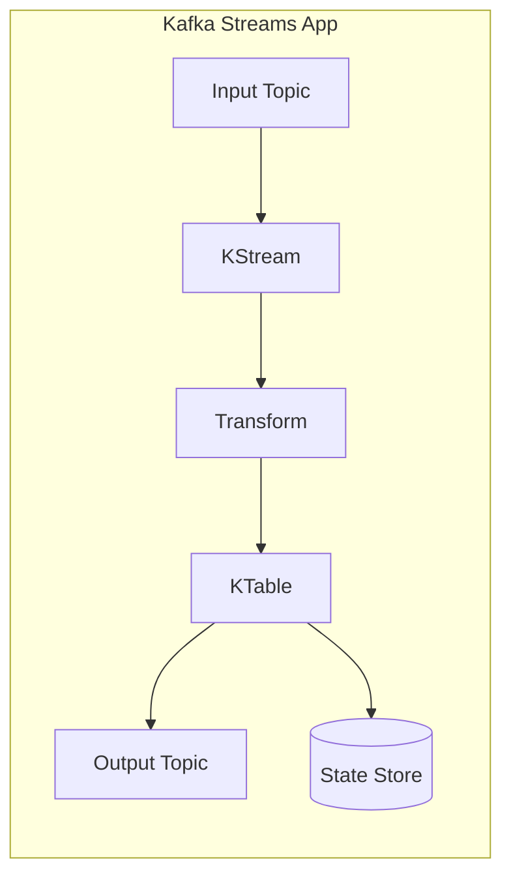
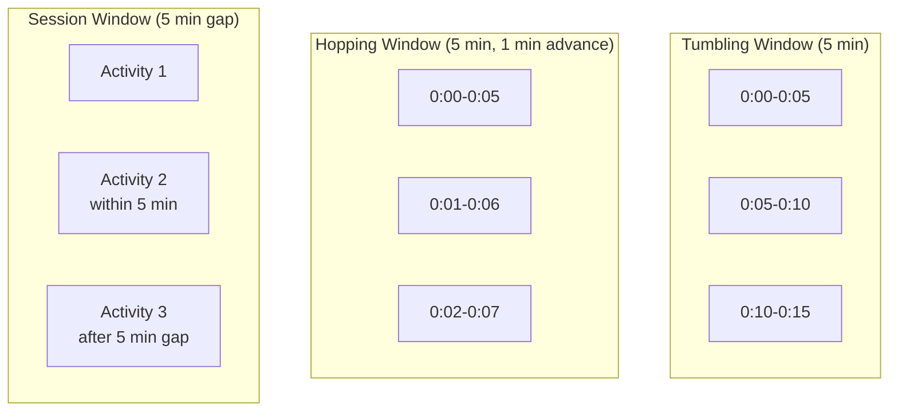

# Chapter 10: Kafka Streams with Spring

Kafka Streams is a client library for building stateful stream processing applications. This chapter covers KStream, KTable, state stores, windowing, and interactive queries.

## Learning Objectives

By the end of this chapter, you will:
- Understand KStream vs KTable semantics
- Build stateful stream processing topologies
- Implement windowing operations
- Use interactive queries for state store access

## Stream Processing Concepts



### KStream vs KTable

| KStream | KTable |
|---------|--------|
| Infinite sequence of records | Changelog/table semantics |
| Each record is independent | Updates replace previous values |
| Like INSERT statements | Like UPDATE statements |
| Good for events | Good for state/lookups |

## Building Topologies

### Basic Topology

```java
@Configuration
public class StreamsConfig {

    @Bean
    public KStream<String, PageView> pageViewStream(StreamsBuilder builder) {
        KStream<String, PageView> views = builder.stream("page-views");

        views
            .filter((key, view) -> view.duration() > 10)
            .mapValues(view -> view.withProcessedTimestamp(Instant.now()))
            .to("processed-page-views");

        return views;
    }
}
```

### Stateful Processing

```java
@Bean
public KTable<String, Long> pageViewCounts(StreamsBuilder builder) {
    KStream<String, PageView> views = builder.stream("page-views");

    return views
        .groupBy((key, view) -> view.pageId())
        .count(Materialized.as("page-view-counts"));
}
```

## Windowing Operations



### Implementation

```java
@Bean
public KTable<Windowed<String>, Long> windowedCounts(StreamsBuilder builder) {
    KStream<String, PageView> views = builder.stream("page-views");

    return views
        .groupBy((key, view) -> view.pageId())
        .windowedBy(TimeWindows.ofSizeWithNoGrace(Duration.ofMinutes(5)))
        .count(Materialized.as("windowed-page-counts"));
}
```

## Interactive Queries

```java
@Service
public class PageViewQueryService {

    private final StreamsBuilderFactoryBean factoryBean;

    public Long getPageViewCount(String pageId) {
        KafkaStreams streams = factoryBean.getKafkaStreams();

        ReadOnlyKeyValueStore<String, Long> store = streams.store(
            StoreQueryParameters.fromNameAndType(
                "page-view-counts",
                QueryableStoreTypes.keyValueStore()
            )
        );

        return store.get(pageId);
    }
}
```

## Hands-On: Real-Time Analytics

### Step 1: Run the Application

```bash
cd chapter-10-kafka-streams
mvn spring-boot:run
```

### Step 2: Produce Page Views

```bash
curl -X POST http://localhost:8080/api/page-views \
  -H "Content-Type: application/json" \
  -d '{"pageId": "home", "userId": "user-1", "duration": 30}'
```

### Step 3: Query Counts

```bash
curl http://localhost:8080/api/analytics/page-counts/home
```

## Best Practices

1. **Use Meaningful State Store Names**: Enable interactive queries
2. **Configure Appropriate Caching**: Balance latency vs throughput
3. **Handle Tombstones**: Null values mean deletion in KTables

## Interview Questions

1. **Q**: What's the difference between KStream and KTable?
   **A**: KStream is an unbounded stream where each record is independent (like events). KTable represents changelog where updates replace previous values (like a materialized view).

2. **Q**: How does Kafka Streams handle fault tolerance?
   **A**: State stores are backed by changelog topics. On failure, state is rebuilt from the changelog. Tasks are reassigned to surviving instances.

## References

- [Kafka Streams Documentation](https://kafka.apache.org/documentation/streams/)
- [Spring Cloud Stream](https://spring.io/projects/spring-cloud-stream)

## Next Chapter

Continue to [Chapter 11: Schema Evolution](../chapter-11-schema-evolution/README.md) for schema management.
