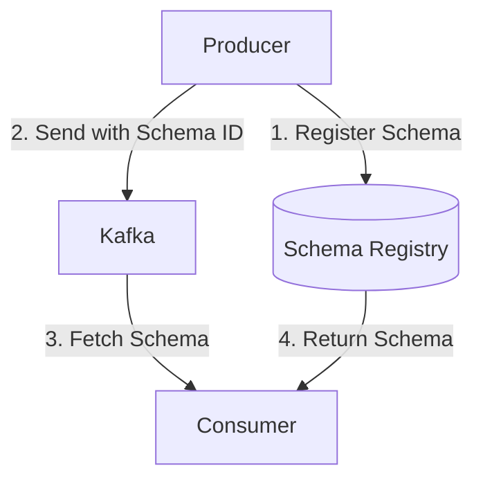

# Chapter 11: Schema Evolution

Managing schema changes without breaking consumers is crucial for production Kafka deployments. This chapter covers Schema Registry, Avro, Protobuf, and compatibility strategies.

## Learning Objectives

- Integrate Confluent Schema Registry
- Use Avro and Protobuf with Spring Kafka
- Understand compatibility modes (backward, forward, full)
- Evolve schemas safely

## Schema Registry Architecture



## Compatibility Modes

| Mode | Description | Safe Changes |
|------|-------------|--------------|
| BACKWARD | New schema reads old data | Add optional fields, remove fields with defaults |
| FORWARD | Old schema reads new data | Remove optional fields, add fields with defaults |
| FULL | Both directions | Only add/remove optional fields with defaults |

## Avro Example

```avro
// customer-v1.avsc
{
  "type": "record",
  "name": "Customer",
  "namespace": "com.kafka.learning",
  "fields": [
    {"name": "id", "type": "string"},
    {"name": "name", "type": "string"},
    {"name": "email", "type": "string"}
  ]
}

// customer-v2.avsc (backward compatible)
{
  "type": "record",
  "name": "Customer",
  "fields": [
    {"name": "id", "type": "string"},
    {"name": "name", "type": "string"},
    {"name": "email", "type": "string"},
    {"name": "phone", "type": ["null", "string"], "default": null}
  ]
}
```

## Spring Kafka Configuration

```yaml
spring:
  kafka:
    producer:
      value-serializer: io.confluent.kafka.serializers.KafkaAvroSerializer
      properties:
        schema.registry.url: http://localhost:8081
        auto.register.schemas: true

    consumer:
      value-deserializer: io.confluent.kafka.serializers.KafkaAvroDeserializer
      properties:
        schema.registry.url: http://localhost:8081
        specific.avro.reader: true
```

## Best Practices

1. **Always Use Compatibility Checking**: Set mode before deploying
2. **Add Fields as Optional**: With default values
3. **Never Remove Required Fields**: Make optional first
4. **Version Your Topics**: Consider `topic-v1`, `topic-v2` for breaking changes

## Interview Questions

1. **Q**: What is backward compatibility?
   **A**: New consumers can read data produced with older schemas. Safe for rolling deployments where consumers upgrade before producers.

## Next Chapter

Continue to [Chapter 12: Performance Tuning](../chapter-12-performance-tuning/README.md).
