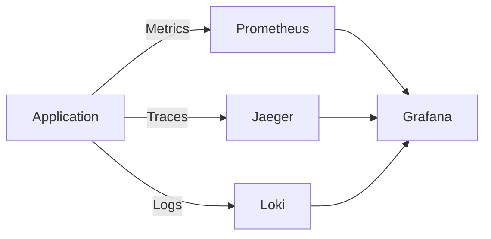

# Chapter 13: Observability

Monitor Kafka applications with metrics, tracing, and logging.

## Learning Objectives

- Integrate Micrometer metrics with Prometheus
- Implement distributed tracing
- Correlate logs across services
- Build Grafana dashboards

## Observability Architecture



## Metrics Configuration

```yaml
spring:
  kafka:
    listener:
      observation-enabled: true

management:
  endpoints:
    web:
      exposure:
        include: health,info,prometheus,metrics
  metrics:
    distribution:
      percentiles-histogram:
        kafka: true
```

## Key Kafka Metrics

| Metric | Description | Alert Threshold |
|--------|-------------|-----------------|
| `kafka.consumer.records.lag` | Consumer lag | > 1000 for 5 min |
| `kafka.producer.record.send.rate` | Send rate | Sudden drop |
| `kafka.consumer.fetch.latency` | Fetch time | > 1s |

## Distributed Tracing

```java
@KafkaListener(topics = "orders")
public void processOrder(
        Order order,
        @Header(KafkaHeaders.RECEIVED_KEY) String key) {

    // Trace context automatically propagated
    log.info("Processing order: {}", order.orderId());
    processOrder(order);
}
```

## Grafana Dashboard

Access the dashboard at `http://localhost:3000` after starting the full stack:

```bash
cd ../infrastructure
docker-compose -f docker-compose-full.yml up -d
```

## Best Practices

1. **Set Up Alerts**: Consumer lag, error rates
2. **Correlate Traces**: Use trace IDs in logs
3. **Dashboard by Service**: Group metrics logically

## Next Chapter

Continue to [Chapter 14: Security](../chapter-14-security/README.md).
