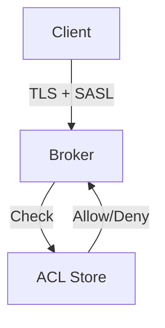

# Chapter 14: Security

Secure Kafka clusters with authentication, encryption, and authorization.

## Learning Objectives

- Configure SASL/SCRAM authentication
- Enable TLS encryption
- Set up ACLs for authorization
- Implement multi-tenant security

## Security Architecture



## SASL/SCRAM Configuration

### Broker Configuration

```properties
listeners=SASL_SSL://0.0.0.0:9093
security.inter.broker.protocol=SASL_SSL
sasl.mechanism.inter.broker.protocol=SCRAM-SHA-512
sasl.enabled.mechanisms=SCRAM-SHA-512
```

### Client Configuration

```yaml
spring:
  kafka:
    properties:
      security.protocol: SASL_SSL
      sasl.mechanism: SCRAM-SHA-512
      sasl.jaas.config: >
        org.apache.kafka.common.security.scram.ScramLoginModule required
        username="client"
        password="secret";
    ssl:
      trust-store-location: classpath:kafka.truststore.jks
      trust-store-password: changeit
```

## ACLs

```bash
# Allow producer to write to orders topic
kafka-acls --bootstrap-server localhost:9093 \
  --add --allow-principal User:order-service \
  --operation Write --topic orders

# Allow consumer to read from orders topic
kafka-acls --bootstrap-server localhost:9093 \
  --add --allow-principal User:order-processor \
  --operation Read --topic orders \
  --group order-processor-group
```

## Best Practices

1. **Use SCRAM-SHA-512**: Stronger than SCRAM-SHA-256
2. **Enable TLS**: Encrypt all traffic
3. **Principle of Least Privilege**: Minimal ACLs per service
4. **Rotate Credentials**: Regular password rotation

## Next Chapter

Continue to [Chapter 15: Operational Patterns](../chapter-15-operational-patterns/README.md).
