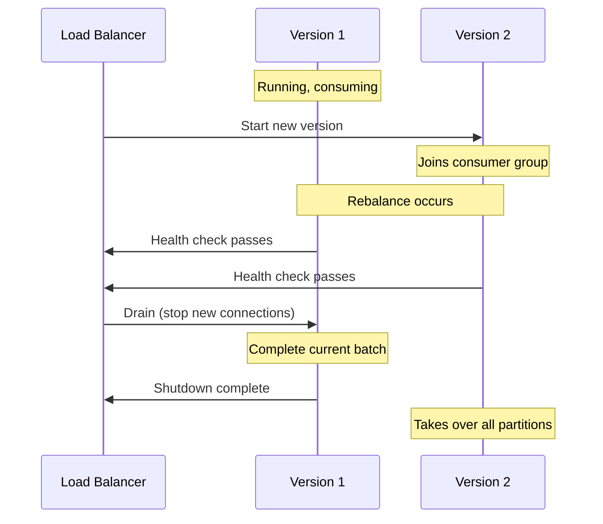

# Chapter 15: Operational Patterns

Run Kafka applications reliably in production with health checks, graceful shutdown, and zero-downtime deployments.

## Learning Objectives

- Monitor consumer lag
- Implement graceful shutdown
- Build comprehensive health checks
- Deploy with zero downtime

## Graceful Shutdown

```java
@Component
public class GracefulShutdownHandler {

    private final KafkaListenerEndpointRegistry registry;

    @PreDestroy
    public void onShutdown() {
        log.info("Initiating graceful shutdown...");

        // Stop accepting new messages
        registry.getListenerContainers().forEach(container -> {
            log.info("Stopping container: {}", container.getListenerId());
            container.stop();
        });

        log.info("All containers stopped gracefully");
    }
}
```

## Health Checks

```java
@Component
public class KafkaHealthIndicator implements HealthIndicator {

    private final AdminClient adminClient;

    @Override
    public Health health() {
        try {
            adminClient.describeCluster()
                .nodes()
                .get(5, TimeUnit.SECONDS);
            return Health.up()
                .withDetail("status", "Kafka cluster is reachable")
                .build();
        } catch (Exception e) {
            return Health.down()
                .withDetail("error", e.getMessage())
                .build();
        }
    }
}
```

## Consumer Lag Monitoring

```java
@Scheduled(fixedRate = 60000)
public void checkConsumerLag() {
    Map<TopicPartition, Long> endOffsets = consumer.endOffsets(partitions);
    Map<TopicPartition, OffsetAndMetadata> committed = consumer.committed(partitions);

    for (TopicPartition tp : partitions) {
        long lag = endOffsets.get(tp) - committed.get(tp).offset();
        if (lag > threshold) {
            alertService.sendAlert("Consumer lag for " + tp + ": " + lag);
        }
    }
}
```

## Zero-Downtime Deployment



## Configuration

```yaml
spring:
  kafka:
    listener:
      # Cooperative rebalancing for smoother deployments
      properties:
        partition.assignment.strategy: org.apache.kafka.clients.consumer.CooperativeStickyAssignor

server:
  shutdown: graceful

spring:
  lifecycle:
    timeout-per-shutdown-phase: 30s
```

## Best Practices

1. **Use Cooperative Rebalancing**: Minimize disruption during deployments
2. **Implement Health Checks**: Both liveness and readiness
3. **Monitor Lag Continuously**: Alert before it becomes critical
4. **Test Failover**: Regularly test failure scenarios

## Interview Questions

1. **Q**: How do you achieve zero-downtime deployments with Kafka consumers?
   **A**: Use cooperative sticky assignor for incremental rebalancing, implement graceful shutdown to complete in-flight messages, configure proper health checks, and use rolling deployments with sufficient replicas.

## Conclusion

Congratulations! You've completed the Kafka learning book. You now have a deep understanding of:
- Kafka internals and architecture
- Spring Kafka integration patterns
- Advanced streaming and event-driven patterns
- Production-ready operational practices

Continue practicing with the hands-on exercises and refer back to specific chapters as needed.
